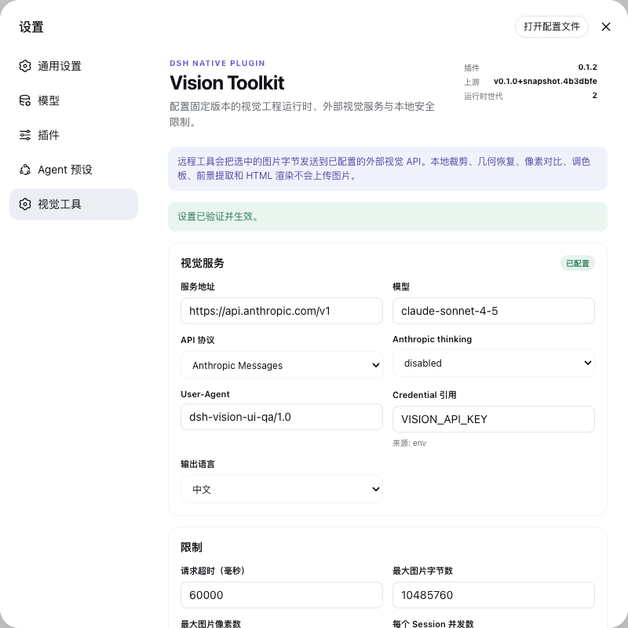

# DSH Vision Toolkit

English | [中文](README.zh.md)

DSH Vision Toolkit (`@dsh-external/dsh-vision-toolkit`) gives text-only DeepSeek Harness agents a native visual-engineering workbench. One out-of-tree Profile Bundle installs structured tools, the matching `vision-tools` skill, a reproducible Python runtime, DSH Credentials integration, managed Artifacts, dedicated Web views, and live Settings without modifying DSH Core or asking the model to construct shell commands.

The package delivers the complete P0 and P1 product scope. P2's stable `ctx.visionToolkit` service remains deliberately unpublished until an independent plugin becomes a real consumer; the tools and internal runtime do not pretend that an unvalidated ecosystem API is stable.



## What ships

- A portable bundle patch for Web and Headless profiles, committed `lib/` output, reproducible build inputs, and atomic tool/skill enablement.
- A pinned MIT-licensed `agent-vision-toolkit` snapshot, managed and exact external runtime modes, and a read-only version probe.
- Ten native visual tools covering remote image understanding, original-pixel grounding, local geometry and pixel analysis, long-screenshot OCR, and HTML rendering.
- Stable model-visible JSON plus formally described files under the session workspace; no image bytes or browser-only access URLs enter model context.
- Dedicated Web cards for every tool, signed image/SVG preview and download, and an `openFile` fallback when no HTTP host is available.
- A live Vision Toolkit Settings section that validates and prepares a candidate runtime before persisting or activating it, preserves the serving generation after failure, and never returns a credential value.

## Tools

| Tool | Execution | Structured result | Artifact delivery |
|---|---|---|---|
| `vision_glance` | Remote vision API | Description, targeted answer, OCR, or multi-image comparison | None |
| `vision_ground` | Remote vision API; optional local preview | Target, original-image dimensions, and pixel boxes | Optional labeled PNG |
| `vision_detect` | Remote vision API; optional local preview | Numbered element inventory and original-image pixel boxes | Optional numbered PNG |
| `vision_trace` | Local pinned vtracer pipeline | SVG geometry status, path count, scale, and size | SVG |
| `vision_crop` | Local Pillow pipeline | Applied pixel box, dimensions, format, and clamp status | PNG or JPEG |
| `vision_pixel_diff` | Local NumPy/Pillow pipeline | Difference percentage and ranked grid regions | PNG heatmap and JSON report |
| `vision_long_screenshot_ocr` | Local split/audit; remote OCR unless `splitOnly=true` | Chunk boundaries, reuse state, completion state, and run directory | Markdown, manifest, boundary audit, chunk PNGs, and OCR sidecars |
| `vision_extract_foreground` | Local pinned extraction pipeline | Selected box, component counts, foreground coverage, and dimensions | Transparent PNG |
| `vision_dominant_colors` | Local pinned color analysis | Extracted palette or pixel-backed candidate ranking | None |
| `vision_html_screenshot` | Local Chrome/Chromium/Edge adapter | Authorized source facts, viewport, and rendered dimensions | PNG |

The plugin does not reimplement visual algorithms. Its DSH-owned layer validates paths and limits, resolves credentials, calls the pinned upstream scripts with argv vectors, parses their exact output contracts, classifies failures, describes files, and projects results to the model and Web client.

## Requirements

- DeepSeek Harness with a Web or Headless profile and `pnpm` available to `dsh plugin`.
- Python 3.11 or newer. Managed mode creates an isolated environment, so users do not install the upstream CLI or Python packages manually.
- Network access on the first managed-runtime activation unless the exact packages in `runtime/requirements.lock` are already available in the configured package cache.
- An OpenAI-compatible vision endpoint and DSH Credential for `vision_glance`, `vision_ground`, `vision_detect`, and non-split-only long-screenshot OCR. Local tools remain usable without that credential.
- Chrome, Chromium, or Edge only for `vision_html_screenshot`; all other tools remain available when no supported browser is installed.
- PNG, JPEG, GIF, or WebP inputs inside the session workspace or an explicitly configured `allowedDirs` root.

## Install and lifecycle

### Install

Install the bundle into each profile that should expose it:

```sh
dsh plugin --profile web add /path/to/dsh-vision-toolkit
dsh plugin --profile headless add /path/to/dsh-vision-toolkit
dsh --profile web --dump-config | grep vision-toolkit
dsh --profile headless --dump-config | grep vision-toolkit
```

The first managed start verifies the packaged upstream manifest and atomically prepares an isolated environment under `DSH_HOME/cache/dsh-vision-toolkit`. The plugin registers all tools only after preparation succeeds, then mounts the same-version `vision-tools` skill. An initial preparation failure leaves the Web Settings repair surface available but exposes neither tools nor a misleading skill.

### Disable and re-enable

Set the bundle row to `disabled: true` in a profile patch or overlay:

```yaml
- id: vision-toolkit
  disabled: true
```

Remove the flag or set it to `false` to re-enable the plugin. Disposal first cancels plugin-owned visual operations, then removes the tools and skill together; reactivation prepares the configured runtime before either becomes visible. User configuration and completed Artifacts remain intact.

### Upgrade

For a registry installation, update the dependency through the profile package manager:

```sh
dsh plugin --profile web update @dsh-external/dsh-vision-toolkit
dsh plugin --profile headless update @dsh-external/dsh-vision-toolkit
```

For a local path installation, run `add` again against the replacement checkout or tarball. Settings remain in the profile's Settings provider. A candidate runtime is fully validated and prepared before it is persisted and made active; a failed or obsolete concurrent candidate cannot replace the current serving generation.

### Uninstall

```sh
dsh plugin --profile web remove @dsh-external/dsh-vision-toolkit
dsh plugin --profile headless remove @dsh-external/dsh-vision-toolkit
```

`dsh plugin remove` removes both the dependency and its bundle layer. The profile no longer exposes Vision Toolkit tools or skill entries. Managed cache data may be deleted separately when no profile uses the package; it is not active configuration and cannot register anything by itself.

## Configure

The bundle defaults to the managed runtime. A profile patch can override the provider and limits:

```yaml
- id: vision-toolkit
  config:
    provider:
      baseUrl: https://api.inferera.com/v1
      credential: VISION_API_KEY
      model: gemini-3.6-flash
    language: zh
    timeoutMs: 60000
    maxImageBytes: 10485760
    maxImagePixels: 40000000
    concurrency: 4
    runtime:
      mode: managed
    allowedDirs: []
```

### Configuration fields

| Field | Default | Contract |
|---|---|---|
| `provider.baseUrl` | `https://api.inferera.com/v1` | OpenAI-compatible base URL; normalized without trailing slashes |
| `provider.credential` | `VISION_API_KEY` | DSH Credential reference, never a secret value |
| `provider.model` | `gemini-3.6-flash` | Multimodal model name sent to remote tools |
| `language` | `zh` | Vision output language: `zh` or `en` |
| `timeoutMs` | `60000` | Whole-operation deadline, 1000-600000 ms; each tool may request a narrower override |
| `maxImageBytes` | `10485760` | Encoded-byte limit per input image |
| `maxImagePixels` | `40000000` | Decoded-pixel limit per input image |
| `concurrency` | `4` | In-flight operations per session, 1-16 |
| `runtime.mode` | `managed` | `managed` uses the packaged snapshot; `external` accepts only the exact pin |
| `runtime.agentVisionToolkitPath` | unset | Required in `external` mode; exported exact snapshot or clean pinned Git checkout |
| `runtime.python` | unset | Optional Python 3.11+ bootstrap/interpreter override |
| `allowedDirs` | `[]` | Additional realpath-resolved input roots; the session workspace is always allowed |

### Credentials

Create or replace the referenced secret through DSH Credentials:

```sh
dsh credentials set VISION_API_KEY
```

The reference is stored in Settings; the value is not. Remote operations resolve it once per call and inject it only into that subprocess environment. The plugin excludes user `.env` files, checkout `.env` files, `PYTHONPATH`, `PYTHONHOME`, `VIRTUAL_ENV`, and user site-packages so ambient Python or upstream configuration cannot override the selected DSH provider. Logs, errors, tool results, Artifact metadata, and Settings responses never contain the secret.

### Managed and external runtimes

Managed mode verifies `vendor/agent-vision-toolkit/UPSTREAM_MANIFEST.json`, prefers `uv`, falls back to `venv` plus pip, installs exact versions from `runtime/requirements.lock`, coordinates concurrent preparation with a heartbeat lock, and publishes a staged environment only after all probes pass.

External mode is intended for development or controlled deployments:

```yaml
- id: vision-toolkit
  config:
    runtime:
      mode: external
      agentVisionToolkitPath: /opt/agent-vision-toolkit
      python: python3.12
```

The path must be an exported copy matching the packaged manifest or the root of a clean Git checkout at `c27d1a300962b553c0884993c575cd3e819465ce`. Modified tracked files and untracked files are rejected because they can change or shadow the pinned Python behavior.

## Web Settings

The Web profile registers a Vision Toolkit Settings section for the provider URL, Credential reference, model, language, timeout, byte/pixel limits, concurrency, runtime mode, Python override, external source path, and allowed directories. It also shows plugin/upstream versions, the active runtime generation, non-secret Credential configured/source/writable facts, runtime paths, health results, and Artifact-route availability.

`Save and apply` validates the complete value, prepares the candidate Python/upstream runtime, commits the Settings revision, and only then atomically switches generations. A rejected candidate leaves the previous generation serving and is reported separately from a genuinely unavailable runtime. `Reload` always restores the authoritative saved value, even when its revision did not change, so a rejected browser draft is discarded. If initial startup cannot prepare a runtime, the Settings route remains available so a valid configuration can make the first generation operational. A stale browser revision receives a conflict instead of overwriting a newer save; reload before retrying. A read-only Settings provider allows inspection and health checks but disables saves.

`Run health check` performs local checks only. `Test connection` is an explicit action that sends the configured Credential to `GET /models`; it uploads no image and creates no completion. Plugin load and ordinary Settings reads never make that request.

Health, connection testing, and plugin/upstream version inspection are administrative Web Settings capabilities rather than model-facing tools, so their schemas never occupy an agent request.

## Artifacts and presentation

Artifact-producing tools write only under `<workspace>/.dsh-vision-toolkit/artifacts`, either as one validated file or an atomically committed run directory. Each model-visible descriptor contains the path, filename, MIME type, kind, description, source tool, preview intent, and byte size, so Headless agents can reuse the path in later calls without browser support. Before a traced SVG is committed, the runtime parses it as XML: standard declarations and comments are accepted, while doctypes, malformed or multi-root documents, a non-SVG namespace, and reported path/byte mismatches are rejected.

When the Web HTTP host is present, presentation-only metadata adds signed capability URLs for preview and download without altering the canonical tool result. Every read revalidates the signature, managed-root fence, path components, regular-file status, size, device/inode identity where available, extension, and MIME. SVG responses use a sandboxed no-resource CSP and the client renders them in a sandboxed iframe. Without an HTTP host, the same cards retain `Open file` through `openFile` and show the descriptor instead of inventing an inaccessible URL.

## Usage patterns

### Basic calls

```text
vision_glance images=["screenshot.png"] query="What error is shown?"
vision_ground image="screenshot.png" target="the send button" preview=true
vision_detect image="screenshot.png" category="buttons" preview=true
vision_crop image="screenshot.png" region="1067,841,1108,881"
vision_trace image="icon.png" color=true output="icon.svg"
vision_pixel_diff original="reference.png" rebuilt="actual.png" runName="comparison"
vision_long_screenshot_ocr image="page.png" mode="general" jobs=2
vision_extract_foreground image="logo.png" mode="color"
vision_dominant_colors image="screen.png" region="0,0,600,300" top=8
vision_html_screenshot source="implementation.html" width=1200 height=720
```

Common workflows are `vision_ground` → `vision_crop` → `vision_glance`, `vision_ground` → `vision_crop` → `vision_trace`, and reference image → `vision_html_screenshot` → `vision_pixel_diff`. Grounding and detection boxes always use original-image pixels (`x1/y1/x2/y2`).

### UI restoration example

The checked-in [UI restoration example](examples/ui-restoration/README.md) renders a reference, an intentionally inaccurate first implementation, and the final implementation through `vision_html_screenshot`, then compares both candidates through `vision_pixel_diff`:

```sh
npm run example:ui-restoration
npm run example:ui-restoration:write
```

The committed evidence records an initial `6.04%` difference across six non-zero worst regions and a final `0%` difference with no non-zero worst region. Check mode reproduces the tool path and verifies the committed assets; write mode intentionally refreshes the evidence.

## Security and execution model

- Inputs resolve against the session workspace and configured `allowedDirs`; realpath containment prevents traversal and symlink escape.
- Pillow decodes every image before a remote request and verifies bytes, pixels, dimensions, and extension/content agreement. Unsupported or oversized images fail before upload.
- Outputs use random staging files or directories inside the real managed destination, reject symbolic links, and commit only after format and contract validation.
- Remote vision prompts explicitly classify text and instructions visible inside images as untrusted content. The native tool descriptions and bundled skill likewise tell the text agent to treat derived descriptions, labels, and OCR as visual evidence rather than executable instructions.
- All upstream processes use argv vectors through `ctx.subprocess`, inherit caller cancellation, share one hard operation deadline, and terminate with the operation instead of continuing in the background. Plugin disposal aborts active calls before unregistering their tools.
- One live Session retains only the most recent successful `vision_glance` result. An immediate repeat reuses it only when image content, query/OCR mode, region, endpoint, model, language, and Credential are unchanged; failures and other Sessions never share the entry.
- Model-visible data is text, numbers, coordinates, structured JSON, and file descriptors. Tool calls/results remain reconstructable from the Session log; browser previews are presentation metadata only.
- Metrics include tool name, total/upstream duration, bounded image counts/bytes/pixels, cache hits, model, and error category; they exclude base64, authentication headers, secrets, and unbounded upstream output.

`vision_html_screenshot` accepts only authorized local `.html` or `.htm` files, disables network access in the pinned adapter, and launches a Chrome-family browser with `--headless=new`, `--use-mock-keychain`, `--incognito`, and a unique `--user-data-dir` under the system temporary directory. The profile is removed after every call, so headless rendering does not touch the user's daily Chrome profile or macOS login keychain.

## Troubleshooting

| Symptom | Resolution |
|---|---|
| Credential reported missing | Run `dsh credentials set <REF>`, ensure `provider.credential` names that reference, then rerun health. Local-only tools do not need it. |
| Runtime preparation fails | Read the Settings runtime error, verify Python 3.11+, package-cache/network access, disk permissions, and the exact external pin. Save only after correcting the candidate; the active generation remains intact. |
| Chrome is not found | Install Chrome, Chromium, or Edge or configure an environment where one is discoverable. Only `vision_html_screenshot` is unavailable. |
| macOS displays a keychain dialog | Confirm the current built adapter is installed and no stale external `html_shot`/headless Chrome process is running. Current launches use a mock keychain and disposable profile; cancel the dialog rather than resetting the login keychain. |
| Input or output path is rejected | Move the file into the session workspace or add an intentional real directory to `allowedDirs`; remove escaping symlinks. Outputs accept a filename, not an absolute or nested path. |
| Vision service returns 401/403 | Replace the Credential value or select the correct reference and endpoint. Errors remain redacted. |
| Vision service returns 429 | Retry after the provider's rate-limit window or lower `concurrency`. The plugin does not silently switch providers. |
| Operation times out or is cancelled | Raise `timeoutMs` within 1000-600000 ms, reduce image/chunk work, or rerun after cancellation. The subprocess/request is stopped with the operation. |
| Settings save reports a conflict | Reload the section to obtain the current revision, reapply the intended edit, and save again. |
| Settings is read-only | Change the active Settings provider or edit the owning profile configuration; the plugin cannot bypass provider writability. |
| Artifact preview is unavailable | Use `Open file` or the model-visible path. Preview/download URLs exist only while a Web HTTP route is attached. |

## Development and verification

```sh
pnpm run build
pnpm test
pnpm run example:ui-restoration
pnpm pack --dry-run
```

`pnpm run build` verifies the vendored manifest before emitting JavaScript, declarations, and the loader-compatible Web client. The package commits `lib/`, so installation from a checkout does not require a consumer-side build. The keyless real-profile test installs into a clean `DSH_HOME`, boots Headless, executes all five P0 tools plus representative P1 local/remote tools through real tool calls, verifies disable and re-enable behavior, and uninstalls the bundle. See the [requirements traceability reference](docs/requirements-traceability/README.md) for the implementation and verification home of every P0/P1 requirement.

Update the upstream snapshot only through `pnpm run upstream:sync -- <checkout>`, inspect the source and license, regenerate the manifest, and update the adapter compatibility tests and committed `lib/` in the same change. The runtime never fetches upstream `main`.

## Scope

P0 and P1 are product commitments in this package. P2 is a design threshold: no stable `ctx.visionToolkit` service, capability-discovery API, or provider ecosystem is published until at least one independent plugin consumes the internal capability shape. Web upload, drag-and-drop, camera/video/audio/document ingestion, interactive box editing, automatic GUI clicking, service clusters, model routing, model voting, and cross-session vision caches remain outside the current product.

## License

The plugin is MIT-licensed. The packaged `agent-vision-toolkit` snapshot retains its upstream MIT license in `vendor/agent-vision-toolkit/LICENSE` and remains the sole implementation of its visual algorithms.
