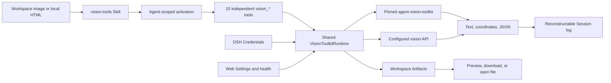

](https://github.com/Anionex/dsh-vision-toolkit/releases/tag/v0.1.4)
[](tests)
[](LICENSE)
[](package.json)
[](runtime/requirements.lock)
[](cordis.patch.yml)

**DSH Vision Toolkit 灏?[`agent-vision-toolkit`](https://github.com/Anionex/agent-vision-toolkit) 浣滀负鍘熺敓 Profile Bundle 甯﹀叆 DeepSeek Harness銆?*

璁╃函鏂囨湰 DSH Agent 鐪熸鐪嬭锛屽苟鐭ラ亾褰撳墠浠诲姟搴旇鐪嬪摢閲岋細閫氳繃甯︽剰鍥剧殑鍥剧墖闂瓟銆丱CR銆佸師鍥惧儚绱犲畾浣嶃€乁I 杩樺師銆佸儚绱犻獙璇併€佹墭绠′骇鐗╁拰 Web Settings 瀹屾垚瑙嗚闂幆銆?0 涓嫭绔嬪伐鍏蜂互缁撴瀯鍖?schema 鍜?Agent 绾ф笎杩涙毚闇插彇浠?Shell 鎷兼帴銆?
**涓婃父宸ュ叿绠憋細** [Anionex/agent-vision-toolkit](https://github.com/Anionex/agent-vision-toolkit) 路 **椤圭洰缃戠珯锛?* [agent-vision.anionex.me](https://agent-vision.anionex.me)

[English](README.md) | 涓枃

## 涓轰粈涔堥渶瑕佸畠

`agent-vision-toolkit` 鎶婅瑙夎涓?Agent 鍙皟鐢ㄧ殑鑳藉姏锛岃€屼笉鏄熀纭€妯″瀷鑷甫鐨勫ぉ璧嬨€傚畠浼氭妸鈥滀负浠€涔堣鐪嬭繖寮犲浘鈥濆甫鍏ヨ瑙夎姹傦紝浠庡叏灞€閫愭鏀舵暃鍒扮洰鏍囧尯鍩燂紝骞剁敤涓撶敤宸ュ叿楠岃瘉鍧愭爣銆侀鑹层€佽疆寤撳拰宸紓锛屼笉鎶婃硾鍖栨弿杩扮洿鎺ュ綋鎴愯瘉鎹€?
DSH Vision Toolkit 淇濈暀杩欏鏂规硶锛屽苟鐢ㄥ師鐢?schema銆丏SH Credentials銆佸彈鐢熷懡鍛ㄦ湡绠＄悊鐨勮繍琛屾椂鍑嗗銆佸彲浠?Session 鏃ュ織閲嶅缓鐨勭粨鏋勫寲缁撴灉銆佸彲棰勮浜х墿銆佷笓鐢?Web 鍗＄墖鍜?Settings 鍙栦唬 CLI 瀹夎涓?Bash 鍙傛暟鎷兼帴銆侫gent 鍔犺浇涓€涓甫鐗堟湰鐨?Skill锛屽彧鏈夊綋鍓嶄换鍔￠渶瑕佽瑙夋椂鎵嶄細鑾峰緱 10 涓伐鍏?schema銆?
鏈寘瀹屾暣浜や粯宸叉壙璇虹殑 P0 涓?P1 浜у搧鑼冨洿銆侾2 鐨勭ǔ瀹?`ctx.visionToolkit` 鏈嶅姟浼氱瓑鍒扮嫭绔嬫彃浠舵垚涓虹湡瀹炴秷璐规柟鍚庡啀鍙戝竷锛涘唴閮ㄨ繍琛屾椂涓嶄細鎶婃湭缁忛獙璇佺殑鐢熸€佹帴鍙ｄ吉瑁呬负绋冲畾濂戠害銆?
## agent-vision-toolkit 宸查獙璇佺殑鐪熷疄鐢ㄤ緥

鍓嶄袱寮犲浘鏄湰 Bundle 鎵€鎵撳寘 `agent-vision-toolkit` 鍥哄畾鐗堟湰鍚屼竴浠ｇ爜绾夸笂鐨勫畼鏂瑰疄璺戠粨鏋滐紱鍥剧墖闂瓟涓庢埅鍥捐緟鍔╂帓闅滆繖涓€寮犲垯鏄湪 DeepSeek Harness Web 涓疄闄呰繍琛岀殑浼氳瘽锛屽睍绀?DSH 涓殑鍚屼竴濂楀伐浣滄祦銆備笂娓稿浘鐗囨潵婧愯[绱犳潗婧簮璁板綍](assets/upstream/README.md)銆?
### 淇℃伅鍥捐繕鍘燂細浠庢埅鍥惧埌鍙紪杈?HTML/CSS

<p align="center">
  
  
</p>

*宸︼細鍘熷鎴浘锛涘彸锛氫笂娓竅淇℃伅鍥捐繕鍘熺ず渚媇(https://github.com/Anionex/agent-vision-toolkit/blob/c27d1a300962b553c0884993c575cd3e819465ce/examples/infographic-restoration/how-is-the-model-trained.html)鐢熸垚鐨勫彲缂栬緫 HTML/CSS 缁撴灉銆?

### UI 杩樺師锛氫粠鎵嬬粯绋垮埌鍙敤鐣岄潰

<p align="center">
  
  
</p>

*宸︼細鎵嬬粯杈撳叆锛涘彸锛氫笂娓歌繕鍘熷嚭鐨勭晫闈紝瀹屾暣鏂规硶瑙?[UI 杩樺師 playbook](https://github.com/Anionex/agent-vision-toolkit/blob/c27d1a300962b553c0884993c575cd3e819465ce/skills/vision-tools/references/restore-ui.md)銆?

### 鍥剧墖闂瓟涓庢埅鍥捐緟鍔╂帓闅?
<p align="center">
  
  
</p>

*宸︼細DSH Web 涓甫鎰忓浘鐨勫浘鐗囬棶绛旓紱鍙筹細DSH Web 涓€氳繃鎴浘瀵规瘮瀹氫綅 UI 瀛楁宸紓锛屽苟缁х画鍚?`vision_pixel_diff` 鎺ㄨ繘銆備笂娓稿伐浣滄祦鏉ユ簮浠嶄负 [`agent-vision-toolkit` 瀹樻柟瀹炶窇](https://github.com/Anionex/agent-vision-toolkit/blob/c27d1a300962b553c0884993c575cd3e819465ce/README.md#real-world-effects)銆?

DSH Vision Toolkit 鍦ㄨ繖浜涗笂娓歌兘鍔涗箣澶栧鍔犲師鐢熷伐鍏?schema銆佺増鏈寲鐢熷懡鍛ㄦ湡銆丆redentials銆佺粨鏋勫寲 Session 缁撴灉銆佷骇鐗┿€乄eb 灞曠ず銆丼ettings 鍜屾笎杩涙毚闇层€備笅涓€鑺傚睍绀虹敱鏈?DSH 浠撳簱瀹為檯鎵ц骞舵彁浜ょ殑鍙鐜板疄璇併€?
## DSH 鍘熺敓瀹炶瘉锛氫粠鍙傝€冨浘鍒板儚绱犵骇涓€鑷?
浠撳簱涓殑 UI 杩樺師娴佺▼浼氭覆鏌撲竴涓晠鎰忎笉鍑嗙‘鐨?HTML 瀹炵幇锛屾祴寰?`6.04%` 鍍忕礌宸紓鍜?6 涓潪闆跺樊寮傚尯鍩燂紱缁忚繃杩唬鍚庯紝鍦?`1200 脳 720` 涓嬭揪鍒扮浉瀵瑰弬鑰冨浘绮剧‘ `0%` 鐨勫樊寮傘€?
<p>
  
  
</p>

| 宸查獙璇佽寖鍥?| 璇佹嵁 |
|---|---|
| 浜у搧鑼冨洿 | 10 涓嫭绔嬭瑙夊伐鍏枫€佸尮閰嶇殑 `vision-tools` Skill銆佷骇鐗┿€佷笓鐢?Web 鍗＄墖鍜屽疄鏃?Settings |
| 鑷姩鍖栬鐩?| 17 涓?Vitest 鏂囦欢 / 134 椤归€氳繃娴嬭瘯锛屼互鍙婁笉渚濊禆 DSH 寮€鍙戞爲鐨勫彲绉绘鍖呮鏌?|
| 鐪熷疄 Profile | 骞插噣涓存椂 Web 涓?Headless 瀹夎銆佹縺娲汇€佺鐢ㄣ€侀噸鏂板惎鐢ㄥ拰鍗歌浇 |
| 瑙嗚楠屾敹 | 鍙鐜扮殑 HTML 鎴浘 鈫?鍍忕礌瀵规瘮绀轰緥锛屾渶缁堝樊寮備负 `0%` |

## 浜偣

- **鐪嬪浘浣嗕笉璁╂瘡杞彁绀鸿瘝鑶ㄨ儉锛?* 鍒濆鍙毚闇?`vision_toolkit_activate`锛涘姞杞?`vision-tools` 鍚庯紝10 涓嫭绔?schema 鎵嶆寕鍒板綋鍓?Agent锛岀増鏈拰鍋ュ悍绠＄悊濮嬬粓涓嶈繘鍏ユā鍨嬩笂涓嬫枃銆?- **鐩存帴浣跨敤鍧愭爣锛岃€屼笉鏄В鏋愯嚜鐒惰瑷€锛?* 瀹氫綅鍜屽厓绱犵洏鐐硅繑鍥炲師鍥惧儚绱犳锛屾墍鏈夋ā鍨嬪彲瑙佺粨鏋滀繚鎸佷负缁撴瀯鍖栨枃瀛楁垨 JSON銆?- **浜や粯姝ｅ紡鏂囦欢锛岃€屼笉鏄复鏃惰緭鍑猴細** 瑁佸壀銆丼VG 鎭㈠銆丱CR銆佸儚绱犲姣斻€佸墠鏅彁鍙栧拰 HTML 娓叉煋浼氱敓鎴愬甫鎻忚堪鐨勪骇鐗╋紝Web 瀹㈡埛绔彲棰勮銆佷笅杞芥垨鍦ㄦ湰鍦版墦寮€銆?- **鍙楁帶绠＄悊杩愯鏃朵笌鍑嵁锛?* API Key 鐢?DSH Credentials 淇濈锛沵anaged 妯″紡鍑嗗绮剧‘闅旂鐨?Python 鐜锛涘け璐ョ殑 Settings 鍊欓€変笉浼氭浛鎹㈠綋鍓嶆湇鍔?generation銆?- **闂悎瑙嗚楠岃瘉寰幆锛?* 鏈湴 HTML 娓叉煋鍜屽儚绱犲樊寮傛帓搴忔敮鎸佸弬鑰冨浘 鈫?瀹炵幇 鈫?鎴浘 鈫?搴﹂噺杩唬锛屼笉渚濊禆妯″瀷鍘熺敓鍥剧墖閫氶亾銆?- **鍚屼竴 Bundle 鍚屾椂鏈嶅姟 Web 涓?Headless锛?* Web 澧炲姞鍗＄墖銆侀瑙堛€丼ettings 鍜屽仴搴锋搷浣滐紱Headless 淇濇寔鐩稿悓宸ュ叿璇箟鍜屽畬鏁寸粨鏋勫寲缁撴灉銆?
## 蹇€熷紑濮?
鍓嶇疆鏉′欢锛欴eepSeek Harness銆丳ython 3.11+锛屽苟纭繚 `dsh plugin` 鍙互浣跨敤 `pnpm`銆備粠 npm registry 瀹夎宸插彂甯冪殑 Bundle锛屽姞鍏ユ墍闇€ Profile锛屽苟纭 Bundle 琛屽凡缁忔寕杞斤細

```sh
dsh plugin --profile web add @dsh-external/dsh-vision-toolkit
dsh plugin --profile headless add @dsh-external/dsh-vision-toolkit
dsh --profile web --dump-config | grep vision-toolkit
dsh --profile headless --dump-config | grep vision-toolkit
```

濡傛灉鏈湴 npm 闀滃儚灏氭湭鍚屾锛?04锛夛紝瀹夎鏃舵寚瀹氬畼鏂?registry锛歚dsh plugin --profile web add @dsh-external/dsh-vision-toolkit --registry=https://registry.npmjs.org`銆?
瀹夎鍚庨噸鍚鍦ㄨ繍琛岀殑 Web Profile锛屾墦寮€ **璁剧疆 鈫?瑙嗚宸ュ叿**锛屼负杩滅▼宸ュ叿閫夋嫨 DSH Credential锛屽苟鏄惧紡鎵ц**娴嬭瘯杩炴帴**銆傚湪浼氳瘽涓妸鍥剧墖鏀捐繘宸ヤ綔鍖鸿矾寰勶紝璋冪敤 `/vision-tools`锛屽啀璁?Agent 浣跨敤鏄庣‘鐨?`vision_*` 宸ュ叿銆傛湰鍦拌鍓€丼VG銆佸儚绱犮€侀鑹层€佸墠鏅拰 HTML 鎿嶄綔涓嶉渶瑕佽瑙?API Credential銆?
鍙€夛細鍦ㄨ缃腑寮€鍚?*绮樿创鍥剧墖鑷姩闄嶇骇**銆傚綋浼氳瘽妯″瀷涓嶆敮鎸佸浘鐗囪緭鍏ユ椂锛岀矘璐寸殑鍥剧墖浼氳嚜鍔ㄤ繚瀛樺埌浼氳瘽宸ヤ綔鍖猴紙`.dsh-vision-toolkit/pastes/`锛夊苟浠ユ枃浠惰矾寰勪氦缁欐ā鍨嬶紝绾枃鏈?Agent 閫氳繃瑙嗚宸ュ叿璇诲彇锛屽伐鍏疯皟鐢ㄥ叏绋嬪彲瑙併€傚師鐢熸敮鎸佸浘鐗囩殑妯″瀷濮嬬粓浼樺厛锛屼笉缁忚繃姝よ矾寰勩€?
## 宸ヤ綔鍘熺悊



鎵€鏈夊伐鍏峰畾涔夐兘璋冪敤鍚屼竴涓?Runtime锛汻untime 鍦ㄥ垎鍙戝埌鍥哄畾涓婃父蹇収鎴栧凡閰嶇疆鐨?OpenAI 鍏煎瑙嗚绔偣鍓嶏紝缁熶竴楠岃瘉璺緞銆侀檺鍒躲€丆redential銆佸彇娑堝拰瓒呮椂銆俉eb 灞曠ず璇诲彇鐩稿悓鐨勭粨鏋勫寲缁撴灉涓庝骇鐗╂弿杩帮紝鍥犳涓嶄細鏀瑰彉 Headless 璇箟銆傚仴搴枫€佽繛鎺ユ祴璇曞拰鐗堟湰妫€鏌ュ彧鐣欏湪 Settings锛屼笉杩涘叆妯″瀷宸ュ叿 schema銆?
## 宸ュ叿

| 宸ュ叿 | 鎵ц鏂瑰紡 | 缁撴瀯鍖栫粨鏋?| 浜х墿浜や粯 |
|---|---|---|---|
| `vision_glance` | 杩滅▼瑙嗚 API | 鎻忚堪銆侀拡瀵规€у洖绛斻€丱CR 鎴栧鍥炬瘮杈?| 鏃?|
| `vision_ground` | 杩滅▼瑙嗚 API锛涘彲閫夋湰鍦伴瑙?| 鐩爣銆佸師鍥惧昂瀵稿拰鍍忕礌妗?| 鍙€夋爣娉?PNG |
| `vision_detect` | 杩滅▼瑙嗚 API锛涘彲閫夋湰鍦伴瑙?| 甯︾紪鍙风殑鍏冪礌娓呭崟鍜屽師鍥惧儚绱犳 | 鍙€夌紪鍙?PNG |
| `vision_trace` | 鏈湴鍥哄畾 vtracer 娴佹按绾?| SVG 鍑犱綍鐘舵€併€佽矾寰勬暟銆佺缉鏀惧拰澶у皬 | SVG |
| `vision_crop` | 鏈湴 Pillow 娴佹按绾?| 瀹為檯鍍忕礌妗嗐€佸昂瀵搞€佹牸寮忓拰瑁佸壀杈圭晫鐘舵€?| PNG 鎴?JPEG |
| `vision_pixel_diff` | 鏈湴 NumPy/Pillow 娴佹按绾?| 宸紓姣斾緥鍜屾帓搴忓悗鐨勭綉鏍煎尯鍩?| PNG 鐑姏鍥惧拰 JSON 鎶ュ憡 |
| `vision_long_screenshot_ocr` | 鏈湴鍒囧垎/瀹¤锛涢櫎 `splitOnly=true` 澶栨墽琛岃繙绋?OCR | 鍒嗗潡杈圭晫銆佸鐢ㄧ姸鎬併€佸畬鎴愮姸鎬佸拰杩愯鐩綍 | Markdown銆乵anifest銆佽竟鐣屽璁°€佸垎鍧?PNG 鍜?OCR 浼撮殢鏂囦欢 |
| `vision_extract_foreground` | 鏈湴鍥哄畾鎻愬彇娴佹按绾?| 閫夊尯銆佽繛閫氬垎閲忔暟銆佸墠鏅鐩栫巼鍜屽昂瀵?| 閫忔槑 PNG |
| `vision_dominant_colors` | 鏈湴鍥哄畾棰滆壊鍒嗘瀽 | 鎻愬彇鐨勮皟鑹叉澘鎴栨湁鍍忕礌璇佹嵁鐨勫€欓€夎壊鎺掑簭 | 鏃?|
| `vision_html_screenshot` | 鏈湴 Chrome/Chromium/Edge 閫傞厤鍣?| 宸叉巿鏉冩簮鏂囦欢淇℃伅銆佽鍙ｅ拰娓叉煋灏哄 | PNG |

鎻掍欢涓嶉噸鏂板疄鐜拌瑙夌畻娉曘€侱SH 渚у彧璐熻矗楠岃瘉璺緞涓庨檺鍒躲€佽В鏋?Credential銆佺敤 argv 鍚戦噺璋冪敤鍥哄畾涓婃父鑴氭湰銆佽В鏋愮簿纭緭鍑哄绾︺€佸垎绫诲け璐ャ€佹弿杩版枃浠讹紝骞舵妸缁撴灉鎶曞奖缁欐ā鍨嬪拰 Web 瀹㈡埛绔€?
## 娓愯繘寮忔ā鍨嬫毚闇?
杩愯鏃跺氨缁姸鎬佸睘浜庢暣涓?Profile锛屼絾 10 涓瑙夋墽琛屽伐鍏风殑 schema 灞炰簬鍏蜂綋 Agent銆侫gent 鍔犺浇 `vision-tools` 鍓嶏紝鎻掍欢鍙础鐚緢灏忕殑 `vision_toolkit_activate` 寮曞宸ュ叿锛涜 Agent 鐨勮姹?schema 涓病鏈夎瑙夋墽琛屽伐鍏枫€傛爣鍑?`skill` 宸ュ叿浠?`name="vision-tools"` 鎴愬姛鍔犺浇鍚庯紝浼氫负涓嬩竴妯″瀷姝ラ鑷姩鎸傝浇鍏ㄩ儴 10 涓伐鍏峰苟闅愯棌寮曞宸ュ叿銆傜洿鎺ヨ皟鐢?`/vision-tools` 浼氭敞鍏?skill 鎸囦护锛涘鏋滄鏃惰瑙夊伐鍏蜂粛涓嶅彲瑙侊紝杩欎簺鎸囦护瑕佹眰璋冪敤涓€娆?`vision_toolkit_activate`銆傛縺娲诲彧褰卞搷褰撳墠 Agent锛汼ession 涓瓨鍦ㄤ笌鎵撳寘 skill 鐗堟湰鍖归厤鐨勬寔涔呰瘉鎹椂鍙互鎭㈠锛屽苟鎸佺画鍒?Agent 鎴栨彃浠惰閲婃斁銆?
鍋ュ悍妫€鏌ャ€佽繛鎺ユ祴璇曚互鍙婃彃浠?涓婃父鐗堟湰妫€鏌ュ睘浜?Web Settings 绠＄悊鎿嶄綔銆俙vision_toolkit_health` 鍜?`vision_toolkit_version` 涓嶆槸妯″瀷宸ュ叿锛屽嵆浣胯瑙夋墽琛屽伐鍏峰凡缁忔縺娲伙紝涔熸案杩滀笉浼氳繘鍏?Agent schema銆?
## 杩愯瑕佹眰

- 鍚敤 Web 鎴?Headless Profile 鐨?DeepSeek Harness锛屽苟纭繚 `dsh plugin` 鍙互浣跨敤 `pnpm`銆?- Python 3.11 鎴栨洿楂樼増鏈€侻anaged 妯″紡浼氬垱寤洪殧绂荤幆澧冿紝鐢ㄦ埛鏃犻渶鎵嬪伐瀹夎涓婃父 CLI锛堝懡浠よ鐣岄潰锛夋垨 Python 鍖呫€?- 棣栨鍚敤 managed 杩愯鏃堕渶瑕佽仈缃戯紱濡傛灉閰嶇疆鐨勮蒋浠跺寘缂撳瓨宸叉湁 `runtime/requirements.lock` 涓殑绮剧‘鐗堟湰锛屽垯鏃犻渶鑱旂綉銆?- `vision_glance`銆乣vision_ground`銆乣vision_detect` 鍜岄潪浠呭垏鍒嗛暱鎴浘 OCR 闇€瑕?OpenAI 鍏煎瑙嗚绔偣鍙?DSH Credential銆傛湰鍦板伐鍏锋棤闇€璇?Credential 涔熷彲浣跨敤銆?- 鍙湁 `vision_html_screenshot` 闇€瑕?Chrome銆丆hromium 鎴?Edge锛涙湭瀹夎鍙楁敮鎸佹祻瑙堝櫒鏃讹紝鍏朵粬宸ュ叿淇濇寔鍙敤銆?- 杈撳叆蹇呴』鏄細璇濆伐浣滃尯鎴栨樉寮?`allowedDirs` 鏍圭洰褰曞唴鐨?PNG銆丣PEG銆丟IF 鎴?WebP銆?
## 瀹夎涓庣敓鍛藉懆鏈?
### 瀹夎

灏?Bundle 瀹夎鍒伴渶瑕佹毚闇茶兘鍔涚殑姣忎釜 Profile锛?
```sh
dsh plugin --profile web add /path/to/dsh-vision-toolkit
dsh plugin --profile headless add /path/to/dsh-vision-toolkit
dsh --profile web --dump-config | grep vision-toolkit
dsh --profile headless --dump-config | grep vision-toolkit
```

瀹夎鍚庨渶瑕侀噸鍚暱鏈熻繍琛岀殑 Web Profile銆傚涓诲湪杩涚▼鍚姩鏃堕€氳繃 `package.json` 鐨?`dsh.client` 澹版槑鍙戠幇宸叉瀯寤虹殑娴忚鍣?Bundle锛涙棫鐨勯《灞?`dshClient` 瀛楁涓嶄細琚壂鎻忋€?
棣栨 managed 鍚姩浼氶獙璇佹墦鍖呯殑涓婃父 manifest锛堝厓鏁版嵁娓呭崟锛夛紝骞跺湪 `DSH_HOME/cache/dsh-vision-toolkit` 涓嬪師瀛愬噯澶囬殧绂荤幆澧冦€傛彃浠跺彧鍦ㄥ噯澶囨垚鍔熷悗鍙戝竷鍚岀増鏈殑 `vision-tools` skill 涓庢縺娲诲紩瀵煎伐鍏凤紱姣忎釜 Agent 鍙湁鍦ㄥ姞杞借 skill 鍚庢墠鑾峰緱鎵ц宸ュ叿銆傚垵娆″噯澶囧け璐ユ椂锛學eb Settings 淇鍏ュ彛浠嶇劧鍙敤锛屼絾鎻掍欢涓嶄細鏆撮湶浠讳綍妯″瀷鑳藉姏鎴栬瀵兼ā鍨嬬殑 skill銆?
### 绂佺敤涓庨噸鏂板惎鐢?
鍦?Profile patch 鎴?overlay 涓妸 Bundle 琛岃涓?`disabled: true`锛?
```yaml
- id: vision-toolkit
  disabled: true
```

鍒犻櫎璇ュ瓧娈垫垨璁句负 `false` 鍗冲彲閲嶆柊鍚敤銆傝祫婧愰噴鏀句細鍏堝彇娑堟彃浠舵嫢鏈夌殑瑙嗚鎿嶄綔锛屽啀绉婚櫎鍏ㄩ儴 Agent 绾у伐鍏枫€佸紩瀵煎伐鍏峰拰 skill锛涢噸鏂板惎鐢ㄦ椂锛岄厤缃殑杩愯鏃跺噯澶囧畬鎴愬悗鎵嶄細鏆撮湶浠讳綍妯″瀷鑳藉姏銆傜敤鎴烽厤缃拰宸插畬鎴愮殑浜х墿浼氫繚鐣欍€?
### 鍗囩骇

閫氳繃娉ㄥ唽琛ㄥ畨瑁呮椂锛屼娇鐢?Profile 鐨勫寘绠＄悊鍛戒护鏇存柊渚濊禆锛?
```sh
dsh plugin --profile web update @dsh-external/dsh-vision-toolkit
dsh plugin --profile headless update @dsh-external/dsh-vision-toolkit
```

閫氳繃鏈湴璺緞瀹夎鏃讹紝瀵规浛鎹㈠悗鐨?checkout 鎴?tarball 鍐嶆鎵ц `add`銆係ettings 淇濆瓨鍦?Profile 鐨?Settings 鎻愪緵鏂逛腑銆傚€欓€夎繍琛屾椂瀹屾垚楠岃瘉鍜屽噯澶囧悗鎵嶄細鎸佷箙鍖栧苟鍚敤锛涘け璐ュ€欓€夋垨宸茬粡闄堟棫鐨勫苟鍙戝€欓€夋棤娉曟浛鎹㈠綋鍓嶆湇鍔?generation銆?
### 鍗歌浇

```sh
dsh plugin --profile web remove @dsh-external/dsh-vision-toolkit
dsh plugin --profile headless remove @dsh-external/dsh-vision-toolkit
```

`dsh plugin remove` 浼氬悓鏃剁Щ闄や緷璧栧強鍏?Bundle 灞傘€侾rofile 闅忓嵆涓嶅啀鏆撮湶婵€娲诲紩瀵煎伐鍏枫€丄gent 绾?Vision Toolkit 宸ュ叿鎴?skill 鏉＄洰銆傛病鏈?Profile 浣跨敤鏈寘鏃跺彲浠ュ彟琛屽垹闄?managed 缂撳瓨锛涚紦瀛樹笉鏄椿鍔ㄩ厤缃紝鏃犳硶鑷娉ㄥ唽浠讳綍鑳藉姏銆?
## 閰嶇疆

Bundle 榛樿浣跨敤 managed 杩愯鏃躲€侾rofile patch 鍙互瑕嗙洊鎻愪緵鏂逛笌闄愬埗锛?
```yaml
- id: vision-toolkit
  config:
    provider:
      baseUrl: https://api.inferera.com/v1
      credential: VISION_API_KEY
      model: gemini-3.6-flash
    language: zh
    timeoutMs: 60000
    maxImageBytes: 10485760
    maxImagePixels: 40000000
    concurrency: 4
    runtime:
      mode: managed
    allowedDirs: []
```

### 閰嶇疆瀛楁

| 瀛楁 | 榛樿鍊?| 濂戠害 |
|---|---|---|
| `provider.baseUrl` | `https://api.inferera.com/v1` | OpenAI 鍏煎鍩虹 URL锛涘幓闄ょ粨灏炬枩鏉犲悗浣跨敤 |
| `provider.credential` | `VISION_API_KEY` | DSH Credential 寮曠敤锛屼笉鏄瘑閽ュ€?|
| `provider.model` | `gemini-3.6-flash` | 杩滅▼宸ュ叿浣跨敤鐨勫妯℃€佹ā鍨嬪悕 |
| `language` | `zh` | 瑙嗚杈撳嚭璇█锛歚zh` 鎴?`en` |
| `degradePastedImages` | `false` | 寮€鍚悗锛學eb 浼氳瘽绮樿创鍥剧墖涓斿綋鍓嶆ā鍨嬩笉鏀寔鍥剧墖杈撳叆鏃讹紝鑷姩鐢ㄨ瑙夋湇鍔℃弿杩板浘鐗囧苟浜ょ粰妯″瀷锛堜細璇濅腑浠嶆樉绀哄師鍥撅級锛涘師鐢熸敮鎸佸浘鐗囩殑妯″瀷濮嬬粓浼樺厛锛屼笉缁忚繃姝よ矾寰?|
| `timeoutMs` | `60000` | 瀹屾暣鎿嶄綔鎴鏃堕棿锛?000-600000 姣锛涙瘡涓伐鍏峰彲璇锋眰鏇寸獎鐨勮鐩栧€?|
| `maxImageBytes` | `10485760` | 姣忓紶杈撳叆鍥剧墖鐨勭紪鐮佸瓧鑺備笂闄?|
| `maxImagePixels` | `40000000` | 姣忓紶杈撳叆鍥剧墖鐨勮В鐮佸儚绱犱笂闄?|
| `concurrency` | `4` | 姣忎釜浼氳瘽鍐呯殑骞跺彂鎿嶄綔鏁帮紝1-16 |
| `runtime.mode` | `managed` | `managed` 浣跨敤鎵撳寘蹇収锛沗external` 鍙帴鍙楃簿纭浐瀹氱増鏈?|
| `runtime.agentVisionToolkitPath` | 鏈缃?| `external` 妯″紡蹇呭～锛涘繀椤绘槸绮剧‘瀵煎嚭蹇収鎴栧浐瀹?commit 鐨勫共鍑€ Git checkout |
| `runtime.python` | 鏈缃?| 鍙€夌殑 Python 3.11+ 寮曞绋嬪簭/瑙ｉ噴鍣ㄨ鐩栧€?|
| `allowedDirs` | `[]` | 棰濆鐨?realpath 瑙ｆ瀽杈撳叆鏍圭洰褰曪紱浼氳瘽宸ヤ綔鍖哄缁堝厑璁?|

### Credential

閫氳繃 DSH Credentials 鍒涘缓鎴栨浛鎹㈠紩鐢ㄦ寚鍚戠殑瀵嗛挜锛?
```sh
dsh credentials set VISION_API_KEY
```

Settings 鍙繚瀛樺紩鐢紝涓嶄繚瀛樺€笺€傛瘡娆¤繙绋嬫搷浣滈兘浼氶噸鏂拌В鏋愬紩鐢紝骞跺彧鎶婂€兼敞鍏ュ搴斿瓙杩涚▼鐜銆傛彃浠舵帓闄ょ敤鎴?`.env`銆乧heckout `.env`銆乣PYTHONPATH`銆乣PYTHONHOME`銆乣VIRTUAL_ENV` 鍜岀敤鎴?site-packages锛岄伩鍏嶇幆澧冧腑鐨?Python 鎴栦笂娓搁厤缃鐩栭€夊畾鐨?DSH 鎻愪緵鏂广€傛棩蹇椼€侀敊璇€佸伐鍏风粨鏋溿€佷骇鐗╁厓鏁版嵁鍜?Settings 鍝嶅簲閮戒笉鍖呭惈瀵嗛挜銆?
### Managed 涓?external 杩愯鏃?
Managed 妯″紡浼氶獙璇?`vendor/agent-vision-toolkit/UPSTREAM_MANIFEST.json`锛屼紭鍏堜娇鐢?`uv`锛屽洖閫€鍒?`venv` 鍔?pip锛屾寜 `runtime/requirements.lock` 瀹夎绮剧‘鐗堟湰锛岄€氳繃 heartbeat 閿佸崗璋冨苟鍙戝噯澶囷紝骞跺彧鍦ㄥ叏閮ㄦ帰閽堥€氳繃鍚庡彂甯?staging 鐜銆?
External 妯″紡鐢ㄤ簬寮€鍙戞垨鍙楁帶閮ㄧ讲锛?
```yaml
- id: vision-toolkit
  config:
    runtime:
      mode: external
      agentVisionToolkitPath: /opt/agent-vision-toolkit
      python: python3.12
```

璇ヨ矾寰勫繀椤绘槸涓庢墦鍖?manifest 涓€鑷寸殑瀵煎嚭鍓湰锛屾垨 commit `c27d1a300962b553c0884993c575cd3e819465ce` 鐨勫共鍑€ Git checkout 鏍圭洰褰曘€傛彃浠舵嫆缁濆凡淇敼鐨?tracked 鏂囦欢鍜?untracked 鏂囦欢锛屽洜涓哄畠浠彲鑳芥敼鍙樻垨閬斀鍥哄畾 Python 琛屼负銆?
## Web Settings

Web Profile 浼氭敞鍐?Vision Toolkit Settings 鍒嗗尯锛屽彲閰嶇疆鎻愪緵鏂?URL銆丆redential 寮曠敤銆佹ā鍨嬨€佽瑷€銆佽秴鏃躲€佸瓧鑺?鍍忕礌闄愬埗銆佸苟鍙戞暟銆佽繍琛屾椂妯″紡銆丳ython 瑕嗙洊鍊笺€乪xternal 婧愮爜璺緞鍜屽厑璁哥洰褰曘€傝椤甸潰杩樹細鏄剧ず鎻掍欢/涓婃父鐗堟湰銆佸綋鍓嶈繍琛屾椂 generation銆佷笉鍚瘑閽ョ殑 Credential configured/source/writable 鐘舵€併€佽繍琛屾椂璺緞銆佸仴搴锋鏌ョ粨鏋滃拰浜х墿璺敱鍙敤鎬с€?
鈥滀繚瀛樺苟搴旂敤鈥濅細楠岃瘉瀹屾暣閰嶇疆锛屽噯澶囧€欓€?Python/涓婃父杩愯鏃讹紝鎻愪氦 Settings revision锛屾渶鍚庢墠鍘熷瓙鍒囨崲 generation銆傚€欓€夎鎷掔粷鏃讹紝涔嬪墠鐨?generation 缁х画鏈嶅姟锛岄〉闈篃浼氭妸杩欑鐘舵€佷笌杩愯鏃剁‘瀹炰笉鍙敤鍖哄垎寮€鏉ャ€傗€滈噸鏂板姞杞解€濆缁堟仮澶嶅悗绔凡淇濆瓨鐨勬潈濞佸€硷紝鍗充娇 revision 娌℃湁鍙樺寲涔熶細涓㈠純琚嫆缁濈殑娴忚鍣ㄨ崏绋裤€傚垵濮嬪惎鍔ㄦ棤娉曞噯澶囪繍琛屾椂鏃讹紝Settings 璺敱浠嶅彲鐢ㄤ簬鎻愪氦鏈夋晥閰嶇疆骞舵縺娲婚涓?generation銆傞檲鏃ф祻瑙堝櫒 revision 涓嶄細瑕嗙洊杈冩柊鐨勪繚瀛樼粨鏋滐紝鑰屾槸杩斿洖鍐茬獊锛涘埛鏂板悗鍐嶉噸璇曘€傚彧璇?Settings 鎻愪緵鏂瑰厑璁告煡鐪嬪拰鍋ュ悍妫€鏌ワ紝浣嗙鐢ㄤ繚瀛樸€?
鈥滆繍琛屽仴搴锋鏌モ€濆彧鎵ц鏈湴妫€鏌ャ€傗€滄祴璇曡繛鎺モ€濇槸鏄惧紡鎿嶄綔锛屼細鎶婂凡閰嶇疆 Credential 鍙戦€佸埌 `GET /models`锛涘畠涓嶄細涓婁紶鍥剧墖锛屼篃涓嶄細鍒涘缓 completion銆傛彃浠跺姞杞藉拰鏅€?Settings 璇诲彇涓嶄細鍙戦€佽璇锋眰銆?
鍋ュ悍妫€鏌ャ€佽繛鎺ユ祴璇曚互鍙婃彃浠?涓婃父鐗堟湰妫€鏌ュ睘浜?Web Settings 绠＄悊鑳藉姏锛岃€屼笉鏄ā鍨嬪伐鍏凤紝鍥犳鍏?schema 姘歌繙涓嶄細鍗犵敤 agent 璇锋眰涓婁笅鏂囥€?
## 浜х墿涓庡睍绀?
浼氱敓鎴愪骇鐗╃殑宸ュ叿鍙兘鍐欏叆 `<workspace>/.dsh-vision-toolkit/artifacts`锛屽啓鍏ュ舰寮忎负鍗曚釜宸查獙璇佹枃浠舵垨鍘熷瓙鎻愪氦鐨勮繍琛岀洰褰曘€傛瘡涓ā鍨嬪彲瑙佷骇鐗╂弿杩伴兘鍖呭惈璺緞銆佹枃浠跺悕銆丮IME 绫诲瀷銆佺绫汇€佽鏄庛€佹潵婧愬伐鍏枫€侀瑙堟剰鍥惧拰瀛楄妭鏁帮紝鍥犳 Headless agent 鏃犻渶娴忚鍣ㄦ敮鎸侊紝涔熻兘鍦ㄥ悗缁皟鐢ㄤ腑澶嶇敤璇ヨ矾寰勩€傛彁浜?trace SVG 鍓嶏紝杩愯鏃朵細鎶婂畠浣滀负 XML 瑙ｆ瀽锛氬厑璁告爣鍑嗗０鏄庝笌娉ㄩ噴锛屼絾鎷掔粷 doctype銆佹牸寮忛敊璇垨澶氭牴鏂囨。銆侀潪 SVG namespace锛屼互鍙婁笂娓告姤鍛婁笌瀹為檯璺緞鏁?瀛楄妭鏁颁笉涓€鑷寸殑缁撴灉銆?
瀛樺湪 Web HTTP 瀹夸富鏃讹紝浠呬緵灞曠ず鐨勫厓鏁版嵁浼氬姞鍏ュ甫绛惧悕鐨勯瑙堝拰涓嬭浇鑳藉姏 URL锛岃€屼笉鏀瑰彉瑙勮寖宸ュ叿缁撴灉銆傛瘡娆¤鍙栭兘浼氶噸鏂伴獙璇佺鍚嶃€乵anaged 鏍圭洰褰曞洿鏍忋€佽矾寰勭粍浠躲€佹櫘閫氭枃浠剁姸鎬併€佸ぇ灏忋€佸彲鐢ㄦ椂鐨?device/inode 韬唤銆佹墿灞曞悕鍜?MIME銆係VG 鍝嶅簲浣跨敤绂佹澶栭儴璧勬簮鐨?sandbox CSP锛屽鎴风閫氳繃 sandbox iframe 娓叉煋銆傛病鏈?HTTP 瀹夸富鏃讹紝鍚屼竴寮犲崱鐗囦繚鐣?`openFile` 鎻愪緵鐨勨€滄墦寮€鏂囦欢鈥濊兘鍔涳紝骞舵樉绀轰骇鐗╂弿杩帮紝涓嶄細浼€犳棤娉曡闂殑 URL銆?
## 浣跨敤鏂瑰紡

### 鍩虹璋冪敤

```text
vision_glance images=["screenshot.png"] query="What error is shown?"
vision_ground image="screenshot.png" target="the send button" preview=true
vision_detect image="screenshot.png" category="buttons" preview=true
vision_crop image="screenshot.png" region="1067,841,1108,881"
vision_trace image="icon.png" color=true output="icon.svg"
vision_pixel_diff original="reference.png" rebuilt="actual.png" runName="comparison"
vision_long_screenshot_ocr image="page.png" mode="general" jobs=2
vision_extract_foreground image="logo.png" mode="color"
vision_dominant_colors image="screen.png" region="0,0,600,300" top=8
vision_html_screenshot source="implementation.html" width=1200 height=720
```

甯歌宸ヤ綔娴佸寘鎷?`vision_ground` 鈫?`vision_crop` 鈫?`vision_glance`銆乣vision_ground` 鈫?`vision_crop` 鈫?`vision_trace`锛屼互鍙婂弬鑰冨浘 鈫?`vision_html_screenshot` 鈫?`vision_pixel_diff`銆侴rounding 鍜?detection 鍧愭爣濮嬬粓浣跨敤鍘熷浘鍍忕礌锛坄x1/y1/x2/y2`锛夈€?
### UI 杩樺師绀轰緥

宸叉彁浜ょ殑 [UI 杩樺師绀轰緥](examples/ui-restoration/README.md) 閫氳繃 `vision_html_screenshot` 娓叉煋鍙傝€冮〉闈€佹晠鎰忎笉鍑嗙‘鐨勫垵鐗堝疄鐜板拰鏈€缁堝疄鐜帮紝鍐嶉€氳繃 `vision_pixel_diff` 姣旇緝涓や釜鍊欓€夌粨鏋滐細

```sh
npm run example:ui-restoration
npm run example:ui-restoration:write
```

宸叉彁浜よ瘉鎹褰曞垵鐗堝樊寮備负 `6.04%`锛屾湁 6 涓潪闆舵渶宸尯鍩燂紱鏈€缁堝樊寮備负 `0%`锛屾病鏈夐潪闆舵渶宸尯鍩熴€侰heck 妯″紡浼氬鐜板伐鍏疯皟鐢ㄨ矾寰勫苟楠岃瘉宸叉彁浜よ祫婧愶紱write 妯″紡浼氭湁鎰忓埛鏂拌瘉鎹€?
## 瀹夊叏涓庢墽琛屾ā鍨?
- 杈撳叆鐩稿浼氳瘽宸ヤ綔鍖哄拰閰嶇疆鐨?`allowedDirs` 瑙ｆ瀽锛況ealpath containment 闃绘璺緞绌胯秺鍜岀鍙烽摼鎺ラ€冮€搞€?- 姣忓紶鍥剧墖閮戒細鍦ㄨ繙绋嬭姹傚墠鐢?Pillow 瑙ｇ爜锛屽苟鏍￠獙瀛楄妭銆佸儚绱犮€佸昂瀵镐互鍙婃墿灞曞悕涓庡唴瀹规槸鍚︿竴鑷淬€備笉鏀寔鎴栬繃澶х殑鍥剧墖浼氬湪涓婁紶鍓嶅け璐ャ€?- 杈撳嚭浣跨敤鐪熷疄 managed 鐩爣鐩綍涓殑闅忔満 staging 鏂囦欢鎴栫洰褰曪紝鎷掔粷绗﹀彿閾炬帴锛屽苟鍙湪鏍煎紡涓庡绾﹂獙璇侀€氳繃鍚庢彁浜ゃ€?- 杩滅▼瑙嗚鎻愮ず璇嶆槑纭皢鍥剧墖涓殑鏂囧瓧鍜屾寚浠ゅ綊绫讳负涓嶅彲淇″唴瀹广€傚師鐢熷伐鍏锋弿杩颁笌鎵撳寘 skill 鍚屾牱瑕佹眰鏂囨湰 agent 鍙妸琛嶇敓鎻忚堪銆佹爣绛惧拰 OCR 褰撲綔瑙嗚璇佹嵁锛岃€屼笉鏄彲鎵ц鎸囦护銆?- 鎵€鏈変笂娓歌繘绋嬮兘閫氳繃 `ctx.subprocess` 浣跨敤 argv 鍚戦噺锛岀户鎵胯皟鐢ㄦ柟鍙栨秷淇″彿锛屽叡浜竴涓畬鏁存搷浣滅‖鎴鏃堕棿锛屽苟闅忔搷浣滅粓姝紝涓嶄細缁х画鍦ㄥ悗鍙拌繍琛屻€傛彃浠堕噴鏀句細鍦ㄦ敞閿€瀵瑰簲宸ュ叿鍓嶄腑姝㈡椿鍔ㄨ皟鐢ㄣ€?- 涓€涓椿鍔ㄤ細璇濆彧淇濈暀鏈€杩戜竴娆℃垚鍔熺殑 `vision_glance` 缁撴灉銆傚彧鏈夊浘鐗囧唴瀹广€侀棶棰?OCR 妯″紡銆佸尯鍩熴€佺鐐广€佹ā鍨嬨€佽瑷€鍜?Credential 閮芥湭鏀瑰彉鏃讹紝绱ф帴鐫€鐨勯噸澶嶈皟鐢ㄦ墠浼氬鐢ㄨ缁撴灉锛涘け璐ヨ皟鐢ㄥ拰鍏朵粬浼氳瘽缁濅笉鍏变韩姝ゆ潯鐩€?- 妯″瀷鍙鏁版嵁浠呭寘鍚枃鏈€佹暟瀛椼€佸潗鏍囥€佺粨鏋勫寲 JSON 鍜屾枃浠舵弿杩般€傚伐鍏疯皟鐢?缁撴灉鍙互浠庝細璇濇棩蹇楅噸寤猴紱娴忚鍣ㄩ瑙堝彧灞炰簬灞曠ず鍏冩暟鎹€?- 鎸囨爣鍖呭惈宸ュ叿鍚嶃€佹€昏€楁椂/涓婃父鑰楁椂銆佹湁鐣屽浘鐗囨暟閲?瀛楄妭/鍍忕礌銆佺紦瀛樺懡涓€佹ā鍨嬪拰閿欒绫诲埆锛涗笉鍖呭惈 base64銆侀壌鏉冨ご銆佸瘑閽ユ垨鏃犵晫涓婃父杈撳嚭銆?
`vision_html_screenshot` 鍙帴鍙楀凡鎺堟潈鐨勬湰鍦?`.html` 鎴?`.htm` 鏂囦欢锛屽湪鍥哄畾閫傞厤鍣ㄤ腑绂佺敤缃戠粶锛屽苟浣跨敤 `--headless=new`銆乣--use-mock-keychain`銆乣--incognito` 鍜岀郴缁熶复鏃剁洰褰曞唴鐨勫敮涓€ `--user-data-dir` 鍚姩 Chrome 绯绘祻瑙堝櫒銆傛瘡娆¤皟鐢ㄥ悗閮戒細鍒犻櫎璇?profile锛屽洜姝ゆ棤澶存覆鏌撲笉浼氭帴瑙︾敤鎴锋棩甯?Chrome Profile 鎴?macOS 鐧诲綍閽ュ寵涓层€?
## 鏁呴殰鎺掓煡

| 鐥囩姸 | 瑙ｅ喅鏂规硶 |
|---|---|
| `Model "..." does not support image input. (attachment-error)` | 鍥剧墖璧颁簡 DSH 鐨勬ā鍨嬪師鐢熼檮浠堕€氶亾锛岀函鏂囨湰妯″瀷浼氬湪 Skill 鎴?Vision Toolkit 杩愯鍓嶆嫆缁濊杞€傝浣跨敤 DSH Paste Input 鐨勯檮浠舵寜閽€佺矘璐存垨鎷栨斁娴佺▼锛岃鏂囦欢鍏堝鍒跺埌浼氳瘽宸ヤ綔鍖哄苟浠ヨ矾寰勫舰寮忚繘鍏ユ秷鎭紝鍐嶈皟鐢?`/vision-tools`銆傚畨瑁呮垨鍗囩骇浠讳竴娴忚鍣ㄦ彃浠跺悗锛岄渶瑕侀噸鍚?Web Profile 骞跺埛鏂伴〉闈€?|
| Credential 鏄剧ず缂哄け | 鎵ц `dsh credentials set <REF>`锛岀‘璁?`provider.credential` 鎸囧悜璇ュ紩鐢紝鍐嶉噸鏂拌繍琛屽仴搴锋鏌ャ€傛湰鍦板伐鍏蜂笉闇€瑕佸畠銆?|
| 杩愯鏃跺噯澶囧け璐?| 鏌ョ湅 Settings 涓殑杩愯鏃堕敊璇紝妫€鏌?Python 3.11+銆佽蒋浠跺寘缂撳瓨/缃戠粶銆佺鐩樻潈闄愬拰绮剧‘ external 鍥哄畾鐗堟湰銆備慨姝ｅ€欓€夊悗鍐嶄繚瀛橈紱褰撳墠 generation 涓嶅彈褰卞搷銆?|
| 鎵句笉鍒?Chrome | 瀹夎 Chrome銆丆hromium 鎴?Edge锛屾垨璁╁叾涓竴涓彲琚繍琛岀幆澧冨彂鐜般€傚彧鏈?`vision_html_screenshot` 涓嶅彲鐢ㄣ€?|
| macOS 寮瑰嚭閽ュ寵涓插璇濇 | 纭瀹夎鐨勬槸褰撳墠鏋勫缓浜х墿锛屼笖娌℃湁閬楃暀鐨勫閮?`html_shot`/headless Chrome 杩涚▼銆傚綋鍓嶅惎鍔ㄤ娇鐢?mock keychain 鍜屼竴娆℃€?profile锛涘彇娑堝璇濇锛屼笉瑕侀噸缃櫥褰曢挜鍖欎覆銆?|
| 杈撳叆鎴栬緭鍑鸿矾寰勮鎷掔粷 | 鎶婃枃浠剁Щ鍏ヤ細璇濆伐浣滃尯锛屾垨鏈夋剰灏嗙湡瀹炵洰褰曞姞鍏?`allowedDirs`锛涚Щ闄や細閫冮€哥殑绗﹀彿閾炬帴銆傝緭鍑哄弬鏁板彧鎺ュ彈鏂囦欢鍚嶏紝涓嶆帴鍙楃粷瀵硅矾寰勬垨宓屽璺緞銆?|
| 瑙嗚鏈嶅姟杩斿洖 401/403 | 鏇挎崲 Credential 鍊硷紝鎴栭€夋嫨姝ｇ‘鐨勫紩鐢ㄥ拰绔偣銆傞敊璇唴瀹逛繚鎸佽劚鏁忋€?|
| 瑙嗚鏈嶅姟杩斿洖 429 | 绛夊緟鎻愪緵鏂归檺娴佺獥鍙ｇ粨鏉熷悗閲嶈瘯锛屾垨闄嶄綆 `concurrency`銆傛彃浠朵笉浼氶潤榛樺垏鎹㈡彁渚涙柟銆?|
| 鎿嶄綔瓒呮椂鎴栬鍙栨秷 | 鍦?1000-600000 姣鑼冨洿鍐呮彁楂?`timeoutMs`銆佸噺灏戝浘鐗?鍒嗗潡宸ヤ綔閲忥紝鎴栧湪鍙栨秷鍚庨噸鏂版墽琛屻€傚瓙杩涚▼/璇锋眰浼氶殢鎿嶄綔鍋滄銆?|
| Settings 淇濆瓨鍐茬獊 | 閲嶆柊鍔犺浇鍒嗗尯浠ュ彇寰楀綋鍓?revision锛岄噸鏂板簲鐢ㄧ洰鏍囦慨鏀癸紝鍐嶆淇濆瓨銆?|
| Settings 鍙 | 鏇存崲娲诲姩 Settings 鎻愪緵鏂癸紝鎴栫紪杈戝叾鎷ユ湁鐨?Profile 閰嶇疆锛涙彃浠朵笉鑳界粫杩囨彁渚涙柟鍙啓鎬с€?|
| 鏃犳硶棰勮浜х墿 | 浣跨敤鈥滄墦寮€鏂囦欢鈥濇垨妯″瀷鍙璺緞銆傚彧鏈?Web HTTP 璺敱宸叉寕杞芥椂鎵嶅瓨鍦ㄩ瑙?涓嬭浇 URL銆?|

## 寮€鍙戜笌楠岃瘉

```sh
npm run verify:portable
pnpm run build
pnpm test
pnpm run example:ui-restoration
pnpm pack --dry-run
```

`npm run verify:portable` 鏄笉渚濊禆澶栭儴寮€鍙戝寘鐨勫彲绉绘楠岃瘉闂ㄧ锛氶獙璇佷笂娓稿揩鐓с€乸ackage 鍏冩暟鎹笌 exports銆佸凡鎻愪氦 JavaScript 璇硶銆丷EADME 閾炬帴鍜屽浘鐗囥€佸繀闇€鐨勫紑婧愰棬闈㈡枃浠躲€乻ocial preview 灏哄浠ュ強 dry-run tarball銆傚畬鏁?TypeScript 鏋勫缓鍜?134 椤规祴璇曚細鍦?DeepSeek Harness 婧愮爜鏍戜腑杩愯锛屾湰 checkout 闇€浣嶄簬鍏朵腑鐨?`dsh-vision-toolkit/`锛屼互浣跨敤瀵瑰簲鐨?peer API 绫诲瀷鍜岀湡瀹?Profile fixture銆?
`pnpm run build` 浼氬厛楠岃瘉 vendored manifest锛屽啀鐢熸垚 JavaScript銆佸０鏄庢枃浠跺拰 loader 鍏煎 Web 瀹㈡埛绔€傛湰鍖呮彁浜?`lib/`锛屽洜姝や粠 checkout 瀹夎鏃朵笉瑕佹眰娑堣垂鏂规瀯寤恒€傛棤鐪熷疄 Key 鐨勭湡瀹?Profile 娴嬭瘯浼氬畨瑁呭埌骞插噣 `DSH_HOME`銆佸惎鍔?Headless銆侀€氳繃鐪熷疄宸ュ叿璋冪敤鎵ц鍏ㄩ儴浜斾釜 P0 宸ュ叿鍜屽叿鏈変唬琛ㄦ€х殑 P1 鏈湴/杩滅▼宸ュ叿銆侀獙璇佺鐢ㄤ笌閲嶆柊鍚敤琛屼负锛屽苟鍗歌浇 Bundle銆傛瘡椤?P0/P1 闇€姹傚搴旂殑瀹炵幇涓庨獙璇佷綅缃[闇€姹傝拷韪弬鑰僝(docs/requirements-traceability/README.md)銆?
鏇存柊涓婃父蹇収鏃跺彧鑳芥墽琛?`pnpm run upstream:sync -- <checkout>`锛屾鏌ユ簮鐮佸拰璁稿彲璇侊紝閲嶆柊鐢熸垚 manifest锛屽苟鍦ㄥ悓涓€鍙樻洿涓洿鏂伴€傞厤鍣ㄥ吋瀹规€ф祴璇曞拰宸叉彁浜?`lib/`銆傝繍琛屾椂缁濅笉鎷夊彇涓婃父 `main`銆?
## 椤圭洰鐘舵€佷笌鑼冨洿

鐗堟湰 `0.1.2` 鏄綋鍓?GitHub 绉佹湁鍙戝竷銆侾0 鍜?P1 鏄湰鍖呯殑浜у搧鎵胯銆侾2 鏄璁￠棬妲涳細鑷冲皯涓€涓嫭绔嬫彃浠舵秷璐瑰唴閮ㄨ兘鍔涘舰鎬佸墠锛屼笉鍙戝竷绋冲畾 `ctx.visionToolkit` 鏈嶅姟銆佽兘鍔涘彂鐜?API 鎴栨彁渚涙柟鐢熸€併€俉eb 涓婁紶銆佹嫋鎷姐€佹憚鍍忓ご/瑙嗛/闊抽/鏂囨。杈撳叆銆佷氦浜掑紡鏍囨敞妗嗙紪杈戙€丟UI 鑷姩鐐瑰嚮銆佽繙绋嬫湇鍔￠泦缇ゃ€佹ā鍨嬭矾鐢便€佹ā鍨嬫姇绁ㄥ拰璺ㄤ細璇濊瑙夌紦瀛樹笉灞炰簬褰撳墠浜у搧鑼冨洿銆?
## 绀惧尯涓庡叧浜?
- 鎻愪氦浠ｇ爜銆佸崗璁垨涓婃父蹇収鍙樻洿鍓嶏紝璇峰厛闃呰 [CONTRIBUTING.md](CONTRIBUTING.md)銆?- 鍙鐜扮己闄枫€佽寖鍥存槑纭殑鍔熻兘寤鸿鍜屼娇鐢ㄩ棶棰樿鎻愪氦鍒?[GitHub Issues](https://github.com/Anionex/dsh-vision-toolkit/issues)锛涘浣曢€夋嫨娓犻亾瑙?[SUPPORT.md](SUPPORT.md)銆?- 瀹夊叏婕忔礊蹇呴』鎸?[SECURITY.md](SECURITY.md) 绉佷笅鎶ュ憡锛屼笉瑕佸垱寤哄叕寮€ Issue銆?- 鐗堟湰涓庡吋瀹规€у彉鍖栬褰曞湪 [CHANGELOG.md](CHANGELOG.md)銆?- 鍙€夎禐鍔╂柟寮忎笌鐢ㄩ€旇 [FUNDING.md](FUNDING.md)锛涜禐鍔╀笉璐拱璺嚎鍥句紭鍏堢骇鎴栫鏈夋敮鎸併€?- 閫氱敤宸ュ叿绠便€佽法 Harness 鎺ュ叆銆佽瑙変换鍔?playbook 鍜屽畼鏂瑰疄璺戞渚嬭璁块棶涓婃父[椤圭洰缃戠珯](https://agent-vision.anionex.me)涓嶽浠ｇ爜浠撳簱](https://github.com/Anionex/agent-vision-toolkit)銆?- 濡傛灉 `agent-vision-toolkit` 鐨勭畻娉曟垨鏂规硶鑺傜渷浜嗘椂闂达紝娆㈣繋涓轰笂娓?star銆佸垎浜€佽础鐚垨璧炲姪锛汥SH 涓撳睘缂洪櫡鍜岄泦鎴愰渶姹傝鎻愪氦鍒版湰浠撳簱銆?
[`agent-vision-toolkit`](https://github.com/Anionex/agent-vision-toolkit) 鐢?[Anionex](https://anionex.me/) 鍒涘缓銆傛湰浠撳簱缁存姢瀹冮潰鍚?DeepSeek Harness 鐨勫師鐢熼泦鎴愶細DSH 渚ц礋璐ｇ敓鍛藉懆鏈熴€佸畨鍏ㄣ€佺粨鏋勫寲 schema銆丆redentials銆佷骇鐗╁拰 Web 灞曠ず锛涜瑙夌畻娉曚笌鍙鐢?playbook 缁х画鐢变笂娓搁」鐩淮鎶ゃ€?
## 璁稿彲璇?
鎻掍欢閲囩敤 MIT 璁稿彲銆傛墦鍖呯殑 `agent-vision-toolkit` 蹇収鍦?`vendor/agent-vision-toolkit/LICENSE` 淇濈暀涓婃父 MIT 璁稿彲璇侊紝骞剁户缁綔涓鸿瑙夌畻娉曠殑鍞竴瀹炵幇銆?