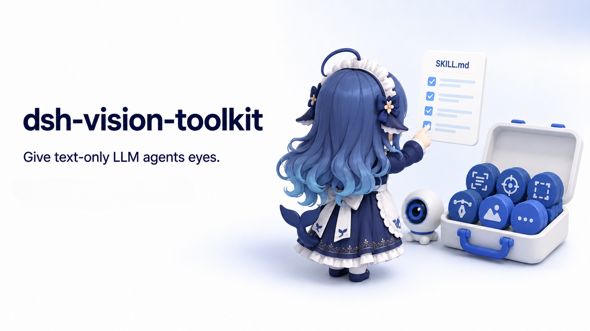
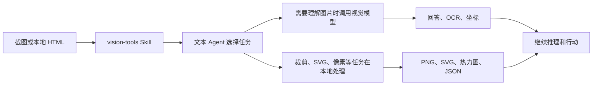

<p align="center">
  
</p>

<div align="center">

# DSH Vision Toolkit

[](https://dshfind.com/zh/plugins/Anionex/dsh-vision-toolkit)
[](https://www.npmjs.com/package/@anionex/dsh-vision-toolkit)
[](LICENSE)
[](cordis.patch.yml)

**给 DSH 里的纯文本 Agent 装上眼睛：粘贴图片就能问，找到元素就能继续操作，还能把 UI 还原做到有数据可验。**

🌐 [English](README.md) ｜ **中文**

</div>

如果你在 DeepSeek Harness（DSH）里使用 DeepSeek 等纯文本模型，可能已经遇到过这些问题：模型看不到截图、只能得到一段泛泛的图片描述、找不到按钮的准确位置，或者还原出来的页面“看起来差不多”，却不知道到底差了多少。

DSH Vision Toolkit 把 [`agent-vision-toolkit`](https://github.com/Anionex/agent-vision-toolkit) 变成一个原生 DSH 插件。安装后，Agent 不只会“看图”，还会围绕当前任务读取、定位、裁剪、描摹、还原和验证图片。

> **安装即可使用。** 默认接入内置免费 Gemma 4 视觉服务，不需要申请 API Key；裁图、像素对比、颜色分析、前景提取、SVG 描摹和网页截图等本地工具也不消耗视觉 API 请求。

```sh
dsh plugin --profile web add @anionex/dsh-vision-toolkit
```

**上游工具箱：** [Anionex/agent-vision-toolkit](https://github.com/Anionex/agent-vision-toolkit) · **项目网站：** [agent-vision.anionex.me](https://agent-vision.anionex.me)

<details>
<summary><strong>目录</strong></summary>

- [最近更新](#最近更新)
- [它解决什么问题](#它解决什么问题)
- [实际效果](#实际效果)
- [亮点](#亮点)
- [快速开始：三步完成](#快速开始三步完成)
- [常见任务](#常见任务)
- [工具一览](#工具一览)
- [配置与限制](#配置与限制)
- [常见问题](#常见问题)
- [开发与社区](#开发与社区)

</details>

## 最近更新

- **2026-08-16 · Windows Python：** 支持 Microsoft Store Python，解决部分 Windows 用户首次创建隔离环境失败的问题。
- **2026-08-16 · 免费视觉升级：** 默认模型切换到 Gemma 4，解决免 Key 方案看图效果不足的问题。
- **2026-08-16 · 图片粘贴：** 文本模型自动切换到 `(Vision Toolkit)` 变体并保留工作区路径，解决粘贴图片被拦截或后续无法复用的问题。
- **2026-08-16 · 免费额度：** 单客户端、全局和突发额度分别提高到 `100/日`、`400/日` 和 `20/分钟`，解决早期用户容易撞限而共享额度闲置的问题。
- **2026-08-16 · 真实模型测试：** Settings 新增完整图片请求测试，解决 `/models` 可访问却不能证明模型真的会看图的问题。

## 它解决什么问题

| 你遇到的问题 | Vision Toolkit 给出的结果 |
|---|---|
| **纯文本模型看不到截图** | 在 DSH Web 中直接粘贴图片；插件会把图片交给视觉模型，再把与当前问题相关的证据交回文本模型 |
| **图片描述很多，但没有重点** | 问“报错在哪里”“提交按钮是什么颜色”，得到围绕当前任务的回答，而不是通用看图作文 |
| **知道有按钮，却不知道在哪** | 返回原图像素坐标，并可生成带框或带编号的预览图 |
| **长截图 OCR 容易漏行、重复** | 分块读取并保留 Markdown、分块图、清单和审计结果，失败后也能继续 |
| **UI 还原只能凭感觉调** | 把参考图和实现截图做像素对比，给出差异比例、重点区域、热力图和 JSON 报告 |
| **截图里的素材无法继续使用** | 直接得到裁剪图、透明 PNG、主色板或可编辑 SVG，而不只是一段文字 |

## 实际效果

### 在 DSH 里直接粘贴图片提问

<p align="center">
  
</p>

*用户粘贴一张图片，纯文本模型自动切换到对应的 `Vision Toolkit` 变体，并围绕用户的问题读取画面。*

### 从截图到可编辑页面

<p align="center">
  
  
</p>

*左：参考截图；右：用 HTML/CSS 还原出的可编辑结果。视觉结果可以继续进入截图和像素对比流程，而不是停在“描述图片”。*

### 从手绘稿到可用界面

<p align="center">
  
  
</p>

*左：手绘参考；右：根据参考还原的可用界面。*

### 让“差不多”变成“可验证”

仓库内置了一个可复现的 UI 还原示例：初版与参考图的差异为 **6.04%**，经过定位和修正后，在 `1200 × 720` 下达到 **0% 像素差异**。

<p>
  
  
</p>

## 亮点

- **安装后就能免费用。** 新用户默认使用内置 Gemma 4 服务，不需要注册新的模型平台，也不需要先填写 Key。
- **不只描述图片，而是解决当前问题。** Agent 会把当前任务作为视觉关注点，优先返回这一轮真正要用到的内容。
- **返回可以继续工作的结果。** 坐标、OCR、透明 PNG、SVG、截图、热力图和 JSON 都能直接交给下一步。
- **特别适合 UI 和截图工程。** 从参考图、元素定位、素材提取到 HTML 截图和像素对比，形成完整闭环。
- **能本地做的就本地做。** 裁剪、描摹、像素对比、颜色、前景和 HTML 截图不需要上传到视觉模型。
- **Web 与 Headless 使用同一套能力。** Web 中可以预览和下载产物，Headless 中仍会得到可重放的结构化结果和文件路径。

## 快速开始：三步完成

### 1. 安装

```sh
dsh plugin --profile web add @anionex/dsh-vision-toolkit
```

Headless Profile 也可以安装：

```sh
dsh plugin --profile headless add @anionex/dsh-vision-toolkit
```

### 2. 重启并确认

重启正在运行的 Web Profile，打开 **设置 → 视觉工具**。默认免费服务已经配置好；你可以直接运行**测试视觉模型**确认连接。

首次启动会自动准备隔离运行环境，因此需要能访问 Python 包缓存或网络。普通安装不需要下载 `agent-vision-toolkit` 源码，也不需要设置本地路径。

### 3. 粘贴图片，直接说你要做什么

在会话中粘贴截图，或把图片放进会话工作区，然后调用 `/vision-tools`。例如：

```text
看看这张截图，告诉我报错原因和最值得先修的地方。
找到右上角的登录按钮，返回原图像素坐标并生成带框预览图。
把这个图标裁出来并转成 SVG。
按照 reference.png 还原页面，每轮截图后做像素对比，直到主要差异消失。
```

## 常见任务

| 任务 | 推荐工作流 |
|---|---|
| 图片问答 / 截图排障 | 看图 → 围绕当前问题回答 → 必要时继续定位 |
| 找按钮、图标或文字区域 | 定位目标 → 返回像素框 → 生成标注预览 |
| 提取截图里的图标 | 定位 → 裁剪 → 描摹为 SVG |
| 读取长网页截图 | 自动分块 → OCR → 合并 Markdown → 检查边界 |
| 复刻网页或组件 | 参考图 → 实现 → HTML 截图 → 像素对比 → 继续修正 |
| 提取品牌视觉 | 裁剪区域 → 主色分析 → 前景提取 → 导出透明 PNG |

## 工具一览

插件提供 10 个可以单独调用、也可以组合使用的视觉工具：

| 工具 | 最适合解决的问题 | 主要结果 |
|---|---|---|
| `vision_glance` | “这张图里发生了什么？” | 针对性回答、描述、OCR、多图比较 |
| `vision_ground` | “我要找的东西在哪？” | 原图像素坐标、可选带框预览 |
| `vision_detect` | “图里有哪些按钮/图标/元素？” | 编号元素清单、坐标、可选预览 |
| `vision_crop` | “把这块区域单独取出来” | PNG 或 JPEG 裁剪图 |
| `vision_trace` | “把这个图形变成可编辑矢量” | SVG |
| `vision_pixel_diff` | “实现和参考图到底差在哪？” | 差异比例、重点区域、热力图、JSON |
| `vision_long_screenshot_ocr` | “读完这张很长的截图” | Markdown、分块图、清单和审计结果 |
| `vision_extract_foreground` | “把主体抠出来” | 透明 PNG |
| `vision_dominant_colors` | “这块区域用了哪些主要颜色？” | 主色板或候选色排序 |
| `vision_html_screenshot` | “把本地页面渲染成固定尺寸截图” | PNG |

坐标始终使用原图像素格式 `x1,y1,x2,y2`，因此定位结果可以直接交给裁剪、描摹或后续自动化。

## 工作原理

插件把远程图片理解和可重复的本地图片处理放进同一套 Agent 工作流。展开下面的流程可以查看具体边界。

<details>
<summary><strong>架构与图片输入行为</strong></summary>



视觉能力来自打包的固定版本 `agent-vision-toolkit`。DSH 插件负责安装、会话级工具暴露、Credential、路径校验、取消、超时、结果文件和 Web 展示。运行时不会在后台拉取上游 `main`。

对于明确标记为纯文本的模型，插件会注册 `<模型名> (Vision Toolkit)` 变体。默认情况下，在 DSH Web 粘贴图片时会自动切换到该变体，并把图片路径与带当前任务重点的视觉描述一起交给模型。

</details>

## 配置与限制

### 默认免费服务

默认配置使用：

```text
Base URL: https://vision.anionex.me/v1
Model:    gemma-4-26b-a4b-it
API Key:  不需要用户配置
```

这是共享的免费入口，不是无限量私有服务。当前限制如下：

| 限制 | 当前值 |
|---|---:|
| 单客户端 | 每个 UTC 日 100 次 |
| 全局服务 | 每个 UTC 日 400 次 |
| 突发请求 | 60 秒内 20 次 |
| 单张图片大小 | 4 MiB |
| 单张图片像素 | 20,000,000 |
| 单次输出 | 512 tokens |

这些限制用于保护共享额度、避免异常大图占满内存或请求时间。触发限制时，服务会返回明确的原因代码和可读提示；限流响应还会带上 `Retry-After`，不会只得到一个含糊的“模型失败”。

### 使用自己的视觉模型

如果你需要更高额度、私有端点或其他模型，可以在 **设置 → 视觉工具** 中修改提供方，并把 API Key 保存为 DSH Credential。Settings 只保存 Credential 引用，不会回显密钥。

也可以在 Profile patch 中配置：

```yaml
- id: vision-toolkit
  config:
    provider:
      baseUrl: https://api.example.com/v1
      credential: MY_VISION_KEY
      model: your-vision-model
      protocol: openai
```

支持 OpenAI Chat Completions 兼容端点和 Anthropic Messages。Web Settings 页面还可以调整超时、图片限制、并发、运行时和图片输入变体。

### 运行要求

- DeepSeek Harness Web 或 Headless Profile。
- Node.js `^22.19.0` 或 `>=24.0.0`。
- Python 3.11+；插件默认自动创建隔离环境。
- 只有 `vision_html_screenshot` 需要 Chrome、Chromium 或 Edge。
- 图片需为 PNG、JPEG、GIF 或 WebP，并位于会话工作区或明确允许的目录中。

<details>
<summary><strong>安装、升级、禁用和卸载</strong></summary>

```sh
dsh plugin --profile web update @anionex/dsh-vision-toolkit
dsh plugin --profile web remove @anionex/dsh-vision-toolkit
```

如果从已停止发布的 `@dsh-external/dsh-vision-toolkit` 迁移，请先移除旧包，再安装 `@anionex/dsh-vision-toolkit`。

需要临时禁用时，在 Profile patch 中设置：

```yaml
- id: vision-toolkit
  disabled: true
```

重新启用或升级 Web 插件后，请重启 Web Profile 并刷新页面。

</details>

## 常见问题

| 问题 | 处理方式 |
|---|---|
| 粘贴图片后仍提示模型不支持图片 | 重启 Web Profile 并刷新页面，确认当前模型已切换到带 `(Vision Toolkit)` 的变体；也可以把图片先放进会话工作区，再调用 `/vision-tools` |
| 免费服务提示 429 | 按错误中的 `Retry-After` 等待后重试；如果需要稳定高额度，切换到自己的视觉端点 |
| 图片过大或像素超限 | 先裁剪或缩放图片；错误会明确显示是字节还是像素限制 |
| 自定义 Credential 缺失 | 在 **设置 → 视觉工具** 填写 API Key，并确认 Credential 名称与配置一致 |
| 首次运行时准备失败 | 检查 Python 3.11+、网络或包缓存、磁盘权限，然后在 Settings 中重新测试 |
| 找不到 Chrome | 安装 Chrome、Chromium 或 Edge；只有 HTML 截图不可用，其他工具不受影响 |
| 产物无法预览 | 使用“打开文件”或结果中的工作区路径；预览 URL 只在 Web 路由可用时存在 |

## 项目状态与限制

当前版本专注于截图理解、视觉定位、OCR、素材提取、UI 还原和像素级验证。它不是视频/音频/摄像头输入系统，也不会自动点击 GUI；交互式标注编辑、远程服务集群、模型投票和跨会话视觉缓存也不在当前范围内。

## 开发与社区

```sh
pnpm install --frozen-lockfile --trust-lockfile
pnpm run verify:portable
pnpm run build
pnpm test
TSX_TSCONFIG_PATH=tsconfig.json pnpm dlx tsx scripts/ui-restoration-example.ts --check
```

- 贡献前请阅读 [CONTRIBUTING.md](CONTRIBUTING.md)。
- Bug、功能建议和使用问题请提交到 [GitHub Issues](https://github.com/Anionex/dsh-vision-toolkit/issues)；渠道说明见 [SUPPORT.md](SUPPORT.md)。
- 安全漏洞请按 [SECURITY.md](SECURITY.md) 私下报告。
- 版本变化见 [CHANGELOG.md](CHANGELOG.md)，赞助说明见 [FUNDING.md](FUNDING.md)。
- 通用视觉工具、跨 Agent 接入和视觉任务方法论请访问上游 [agent-vision-toolkit](https://github.com/Anionex/agent-vision-toolkit)。

<p align="center">
  
</p>

[`agent-vision-toolkit`](https://github.com/Anionex/agent-vision-toolkit) 由 [Anionex](https://anionex.me/) 创建。本仓库维护它面向 DeepSeek Harness 的原生集成。

## 许可证

插件采用 [MIT License](LICENSE)。打包的上游快照保留其原始 MIT 许可证，见 [`vendor/agent-vision-toolkit/LICENSE`](vendor/agent-vision-toolkit/LICENSE)。
