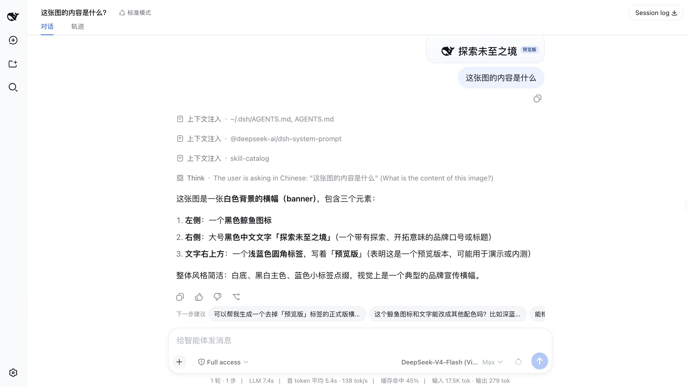
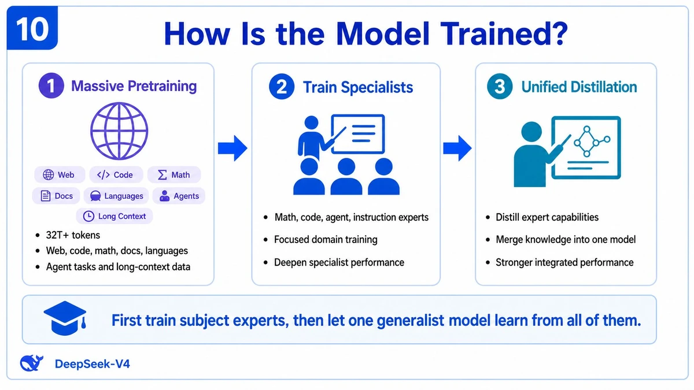
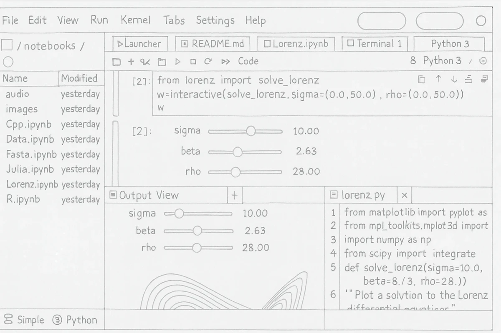
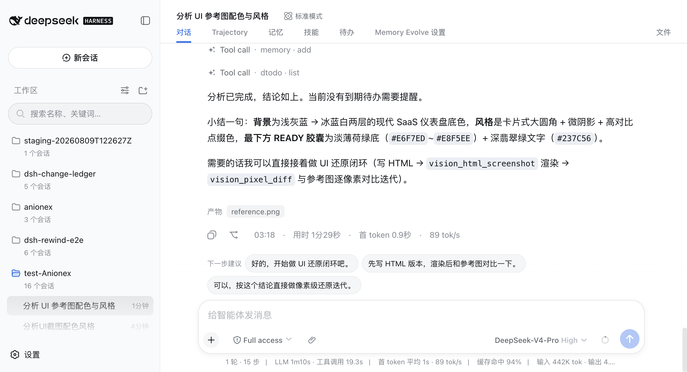
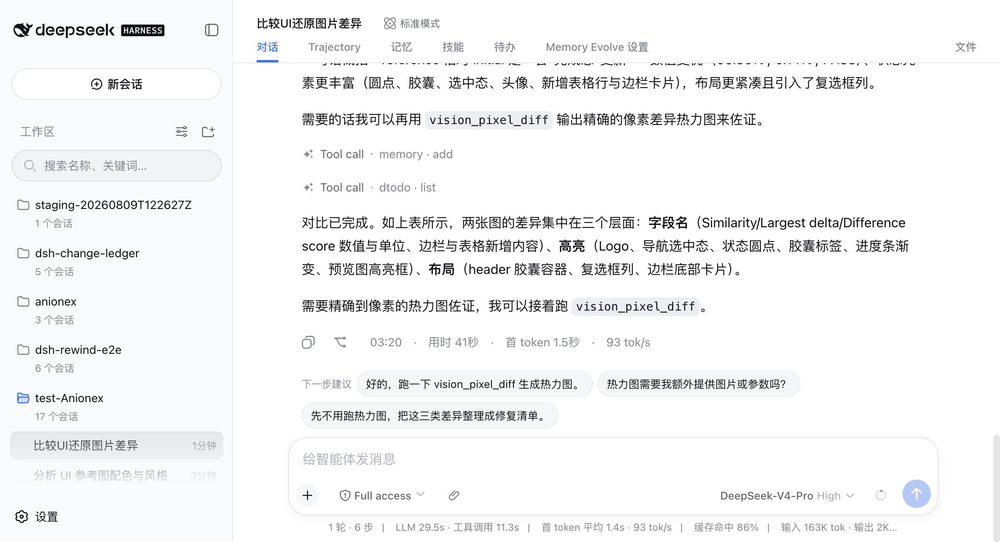
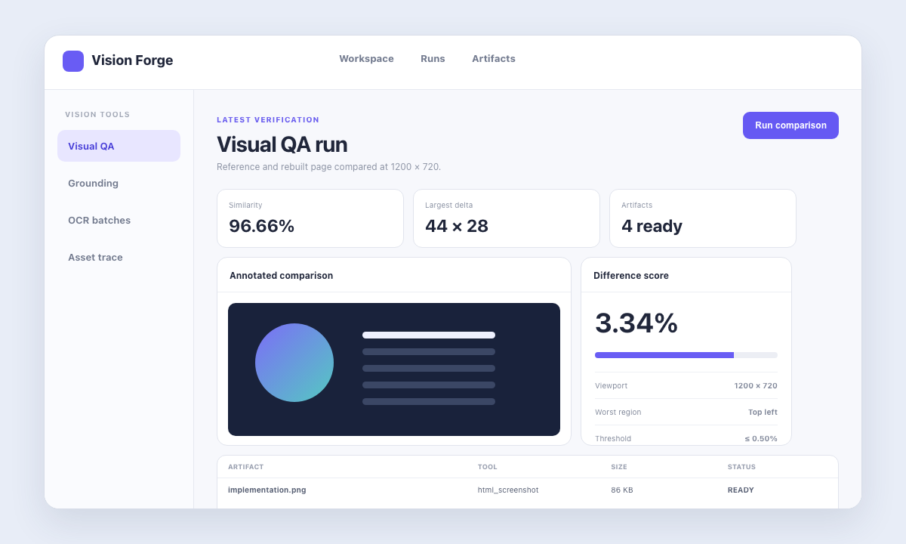
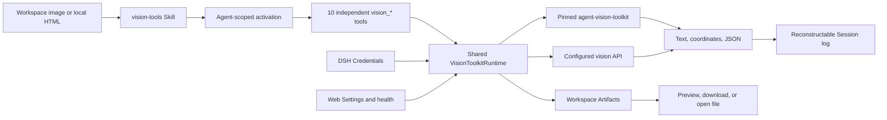

<p align="center">
  
</p>

<h1 align="center">DSH Vision Toolkit</h1>

<p align="center">
  <a href="https://github.com/Anionex/dsh-vision-toolkit/blob/main/README.md">English</a> | 中文
</p>

<p align="center">
  <a href="https://dshfind.com/zh/plugins/Anionex/dsh-vision-toolkit"></a>
  <a href="https://dshfind.com/zh/plugins/Anionex/dsh-vision-toolkit"></a>
  <a href="https://x.com/anion_ex"></a>
  <a href="https://github.com/Anionex/dsh-vision-toolkit/releases/tag/v0.1.10"></a>
  <a href="tests"></a>
</p>

<p align="center">
  <a href="LICENSE"></a>
  <a href="package.json">=24" /></a>
  <a href="runtime/requirements.lock"></a>
  <a href="cordis.patch.yml"></a>
</p>

## 让 DSH Agent 真正看见

把截图交给纯文本 DeepSeek Harness Agent，它就能看懂画面、读取文字、定位元素、提取素材、还原界面，并用像素差异检查结果是否准确。

DSH Vision Toolkit 将 [`agent-vision-toolkit`](https://github.com/Anionex/agent-vision-toolkit) 打包成原生 DSH 插件。安装后即可使用图片问答、OCR、原图像素坐标、UI 还原、像素对比、可下载产物和 Web 设置，无需自己拼接脚本。

```sh
dsh plugin --profile web add @anionex/dsh-vision-toolkit
```

npm 包已经包含视觉工具快照，并默认使用托管运行时。**普通安装不需要下载源码，也不需要填写 `agentVisionToolkitPath`。**

**上游工具箱：** [Anionex/agent-vision-toolkit](https://github.com/Anionex/agent-vision-toolkit) · **项目网站：** [agent-vision.anionex.me](https://agent-vision.anionex.me)

## 你可以用它做什么

| 目标 | Agent 可以交付什么 |
|---|---|
| 看懂截图 | 针对问题作答、描述画面、比较多张图片或执行 OCR |
| 找到界面元素 | 返回原图像素坐标，并可生成带框预览图 |
| 按参考图还原页面 | 渲染网页截图、逐区域诊断差异并持续迭代 |
| 提取可复用素材 | 裁剪图片、透明前景、主色板或可编辑 SVG |
| 读取长截图 | 可审计分块、Markdown、manifest 和可恢复 OCR 运行目录 |
| 验证视觉结果 | 差异百分比、主要偏差区域、热力图和 JSON 报告 |

只有需要理解图片内容时才调用远程视觉模型。裁剪、描摹、像素对比、颜色分析、前景提取和 HTML 截图都在本地运行。

## 看看实际效果

第一个示例是 DSH Web 的真实界面视图；接下来两组示例来自本插件所打包的同一条 `agent-vision-toolkit` 代码线；最后一组展示 DeepSeek Harness Web 中的真实使用流程。素材来源见[素材溯源记录](assets/upstream/README.md)。

### DSH 视图示例

<p align="center">
  
</p>

*真实的 DSH Web 视图：用户粘贴一张品牌横幅截图，纯文本模型通过 `DeepSeek-V4-Flash (Vision Toolkit)` 图片输入变体回答图片内容。*

### 信息图还原：从截图到可编辑 HTML/CSS

<p align="center">
  
  
</p>

*左：原始截图；右：上游[信息图还原示例](https://github.com/Anionex/agent-vision-toolkit/blob/c27d1a300962b553c0884993c575cd3e819465ce/examples/infographic-restoration/how-is-the-model-trained.html)生成的可编辑 HTML/CSS 结果。*

### UI 还原：从手绘稿到可用界面

<p align="center">
  
  
</p>

*左：手绘输入；右：上游还原出的界面，完整方法见 [UI 还原 playbook](https://github.com/Anionex/agent-vision-toolkit/blob/c27d1a300962b553c0884993c575cd3e819465ce/skills/vision-tools/references/restore-ui.md)。*

### 图片问答与截图辅助排障

<p align="center">
  
  
</p>

*左：DSH Web 中带意图的图片问答；右：DSH Web 中通过截图对比定位 UI 字段差异，并继续向 `vision_pixel_diff` 推进。上游工作流来源仍为 [`agent-vision-toolkit` 官方实跑](https://github.com/Anionex/agent-vision-toolkit/blob/c27d1a300962b553c0884993c575cd3e819465ce/README.md#real-world-effects)。*

DSH Vision Toolkit 把这套工作流带进 DSH，让结果可以直接成为文件、坐标、可度量的对比报告，或同一会话中的下一步行动。

## 从大致相似到像素级一致

仓库内的 UI 还原流程从一个故意不准确的 HTML 实现开始。Vision Toolkit 测得 `6.04%` 差异，指出最需要修正的区域，并推动下一轮迭代。最终渲染结果在 `1200 × 720` 下达到精确 `0%` 差异。

<p>
  
  
</p>

| 起点 | 结果 |
|---|---|
| 参考图 | 可打开、可编辑的 HTML 实现 |
| 第一次对比 | 主要问题区域的差异为 `6.04%` |
| 最终对比 | 在 `1200 × 720` 下达到 `0%` 差异 |

## 它为什么好用

- **直接提出你要解决的问题。** “提交按钮在哪里？”和“这张截图为什么和参考图不一样？”都会进入针对性的视觉分析，而不是得到一段泛泛的描述。
- **拿到可以继续使用的证据。** Agent 会返回坐标、OCR、测量结果、JSON 和文件，方便打开或交给下一步处理。
- **工作流留在 DSH 里。** Credential、Settings、产物、Web 卡片和 Headless 结果都与会话的其他内容放在一起。
- **能本地处理就不调用远程模型。** 裁剪、描摹、像素对比、颜色分析、前景提取和 HTML 截图都不消耗视觉 API 请求。
- **让迭代有终点。** 参考图 → 实现 → 截图 → 像素对比，把 UI 还原变成有数据支撑的闭环。

## 三步开始使用

使用 DeepSeek Harness `0.1.0-rc.6` 或兼容的后续 `0.1.x` 版本即可。插件会在第一次使用时准备托管运行时。

```sh
dsh plugin --profile web add @anionex/dsh-vision-toolkit
dsh plugin --profile headless add @anionex/dsh-vision-toolkit
```

1. 重启 Web Profile，打开 **设置 → 视觉工具**。
2. 如果要使用远程视觉模型，选择 DSH Credential，然后执行**测试 API 连接**和**测试视觉模型**。
3. 在会话中粘贴图片或把图片放进工作区，调用 `/vision-tools`，提出一个明确的视觉任务。

如果使用较旧的 DSH launcher，安装前可能需要在 Profile 中设置 `nodeLinker: hoisted` 和 `autoInstallPeers: false`。当前 launcher 会自动修复这些设置。

安装后重启正在运行的 Web Profile，打开 **设置 → 视觉工具**，先执行**测试 API 连接**，再执行**测试视觉模型**。新安装会自动使用内置免费 Moondream 提供方，不需要 API Key 或 DSH Credential。若要使用其他提供方，请修改端点、模型或协议，并配置对应的 DSH Credential。

## 加入交流群

欢迎加入 `agent-vision-toolkit` 项目交流群，交流使用经验、反馈问题并提出建议。

<p align="center">
  
</p>
本地裁剪、SVG、像素、颜色、前景和 HTML 操作不需要视觉 API Credential。

> **不需要本地路径。** 普通 npm 安装保持默认的 `runtime.mode: managed` 即可。`runtime.agentVisionToolkitPath` 只面向明确需要外部固定 checkout 的开发者或受控部署。

<details>
<summary><strong>技术架构</strong></summary>

## 工作原理



所有工具定义都调用同一个 Runtime；Runtime 在分发到固定上游快照或已配置的视觉提供方端点前，统一验证路径、限制、Credential、取消和超时。Web 展示读取相同的结构化结果与产物描述，因此不会改变 Headless 语义。健康、连接测试和版本检查只留在 Settings，不进入模型工具 schema。

</details>

## 工具

| 工具 | 执行方式 | 结构化结果 | 产物交付 |
|---|---|---|---|
| `vision_glance` | 远程视觉 API | 描述、针对性回答、OCR 或多图比较 | 无 |
| `vision_ground` | 远程视觉 API；可选本地预览 | 目标、原图尺寸和像素框 | 可选标注 PNG |
| `vision_detect` | 远程视觉 API；可选本地预览 | 带编号的元素清单和原图像素框 | 可选编号 PNG |
| `vision_trace` | 本地固定 vtracer 流水线 | SVG 几何状态、路径数、缩放和大小 | SVG |
| `vision_crop` | 本地 Pillow 流水线 | 实际像素框、尺寸、格式和裁剪边界状态 | PNG 或 JPEG |
| `vision_pixel_diff` | 本地 NumPy/Pillow 流水线 | 差异比例和排序后的网格区域 | PNG 热力图和 JSON 报告 |
| `vision_long_screenshot_ocr` | 本地切分/审计；除 `splitOnly=true` 外执行远程 OCR | 分块边界、复用状态、完成状态和运行目录 | Markdown、manifest、边界审计、分块 PNG 和 OCR 伴随文件 |
| `vision_extract_foreground` | 本地固定提取流水线 | 选区、连通分量数、前景覆盖率和尺寸 | 透明 PNG |
| `vision_dominant_colors` | 本地固定颜色分析 | 提取的调色板或有像素证据的候选色排序 | 无 |
| `vision_html_screenshot` | 本地 Chrome/Chromium/Edge 适配器 | 已授权源文件信息、视口和渲染尺寸 | PNG |

插件不重新实现视觉算法。DSH 侧只负责验证路径与限制、解析 Credential、用 argv 向量调用固定上游脚本、解析精确输出契约、分类失败、描述文件，并把结果投影给模型和 Web 客户端。

<details>
<summary><strong>高级模型行为</strong></summary>

## 渐进式模型暴露

运行时就绪状态属于整个 Profile，但 10 个视觉执行工具的 schema 属于具体 Agent。Agent 加载 `vision-tools` 前，插件只贡献很小的 `vision_toolkit_activate` 引导工具；该 Agent 的请求 schema 中没有视觉执行工具。标准 `skill` 工具以 `name="vision-tools"` 成功加载后，会为下一模型步骤自动挂载全部 10 个工具并隐藏引导工具。直接调用 `/vision-tools` 会注入 skill 指令；如果此时视觉工具仍不可见，这些指令要求调用一次 `vision_toolkit_activate`。激活只影响当前 Agent；Session 中存在与打包 skill 版本匹配的持久证据时可以恢复，并持续到 Agent 或插件被释放。

健康检查、连接测试以及插件/上游版本检查属于 Web Settings 管理操作。`vision_toolkit_health` 和 `vision_toolkit_version` 不是模型工具，即使视觉执行工具已经激活，也永远不会进入 Agent schema。

## 纯文本模型的图片输入变体

纯文本模型路由仍会获得同名的兄弟模型条目：`<模型名> (Vision Toolkit)`，挂在对应的提供方分组下。但 DSH 原生图片块不会把粘贴附件的本地路径传给模型，因此默认粘贴流程会先把每张图片复制进会话工作区，再把绝对路径插入模型可见的消息。DSH 模型随后可以把这个路径传给 `vision_glance` 或其他视觉工具，并使用与 `agent-vision-toolkit` 对齐的 focus hint 和 `[vision model description]` 通道标记。会话日志保存可复用的路径引用，UI 保留粘贴记录。

插件会自动为宿主明确声明为纯文本的每个模型注册变体（例如 DeepSeek 对话家族）。粘贴处理是全自动的：当当前模型被确认为纯文本、且它的变体已注册时，浏览器端集成会自动把会话切换到变体（会有一条简短提示说明新模型名），随后粘贴走原生流程，无需手动切换模型。宿主依据浏览器从实时模型目录读到的精确模型路由来裁决，模型选择器标签作为兜底；无法确认或支持图片的路由一律保持原生流程，而"纯文本但没有变体"的模型（例如变体被关闭时）继续走"粘贴转路径"：图片被复制进会话工作区，输入框里插入的是它的路径文本。

启用图片输入变体并将 `imageInputVariants.autoSwitch` 设为 `true` 时，描述转换需要已配置的视觉提供方及其 Credential；当运行时未就绪或读取失败时，请求链路上的图片块降级为与上游兼容的 `[vision unavailable: ...]` 提示，而不是让整轮失败。默认路径流程不需要先调用这层自动描述桥接，模型可直接使用收到的图片路径调用视觉工具。桥接不会把注入的上下文文件当作当前用户意图；如果图片来自工具调用，则使用最新的助手段落作为关注提示。用 `imageInputVariants.enabled: false` 关闭变体，用 `imageInputVariants.providers` 限制被包装的路由，或用 `imageInputVariants.autoSwitch: true` 显式启用原生附件自动切换。

</details>

## 运行要求

- 启用 Web 或 Headless Profile 的 DeepSeek Harness，并确保 `dsh plugin` 可以使用 `pnpm`。
- Python 3.11 或更高版本。Managed 模式会创建隔离环境，用户无需手工安装上游 CLI（命令行界面）或 Python 包。
- 首次启用 managed 运行时需要联网；如果配置的软件包缓存已有 `runtime/requirements.lock` 中的精确版本，则无需联网。
- 内置免费 Moondream 提供方可直接用于 `vision_glance`、`vision_ground`、`vision_detect` 和非仅切分长截图 OCR。只有改用自定义 OpenAI 兼容或 Anthropic 端点时才需要 DSH Credential；本地工具不依赖任何远程提供方。
- 只有 `vision_html_screenshot` 需要 Chrome、Chromium 或 Edge；未安装受支持浏览器时，其他工具保持可用。
- 输入必须是会话工作区或显式 `allowedDirs` 根目录内的 PNG、JPEG、GIF 或 WebP。

## 安装与生命周期

### 安装

将 Bundle 安装到需要暴露能力的每个 Profile：

```sh
dsh plugin --profile web add @anionex/dsh-vision-toolkit
dsh plugin --profile headless add @anionex/dsh-vision-toolkit
dsh --profile web --dump-config | grep vision-toolkit
dsh --profile headless --dump-config | grep vision-toolkit
```

安装后需要重启长期运行的 Web Profile。宿主在进程启动时通过 `package.json` 的 `dsh.client` 声明发现已构建的浏览器 Bundle；旧的顶层 `dshClient` 字段不会被扫描。

首次 managed 启动会验证打包的上游 manifest（元数据清单），并在 `DSH_HOME/cache/dsh-vision-toolkit` 下原子准备隔离环境。插件只在准备成功后发布同版本的 `vision-tools` skill 与激活引导工具；每个 Agent 只有在加载该 skill 后才获得执行工具。初次准备失败时，Web Settings 修复入口仍然可用，但插件不会暴露任何模型能力或误导模型的 skill。

### 禁用与重新启用

在 Profile patch 或 overlay 中把 Bundle 行设为 `disabled: true`：

```yaml
- id: vision-toolkit
  disabled: true
```

删除该字段或设为 `false` 即可重新启用。资源释放会先取消插件拥有的视觉操作，再移除全部 Agent 级工具、引导工具和 skill；重新启用时，配置的运行时准备完成后才会暴露任何模型能力。用户配置和已完成的产物会保留。

### 升级

**从已停用的 `@dsh-external/dsh-vision-toolkit` 迁移：** npm 包现在位于 `@anionex` 作用域。如果你安装的是已停用的旧包，**不要**对它执行 `update`——该账号无法发布本版本。请迁移到新包名并重启 Web Profile：

```sh
dsh plugin --profile web remove @dsh-external/dsh-vision-toolkit
dsh plugin --profile web add @anionex/dsh-vision-toolkit
```

重启后，Settings → 视觉工具 应显示插件版本 **0.1.10**。内置免费提供方会自动选中；自定义提供方仍使用配置的 DSH Credential。

通过注册表安装时，使用 Profile 的包管理命令更新依赖：

```sh
dsh plugin --profile web update @anionex/dsh-vision-toolkit
dsh plugin --profile headless update @anionex/dsh-vision-toolkit
```

通过本地路径安装时，对替换后的 checkout 或 tarball 再次执行 `add`。Settings 保存在 Profile 的 Settings 提供方中。候选运行时完成验证和准备后才会持久化并启用；失败候选或已经陈旧的并发候选无法替换当前服务 generation。

### 卸载

```sh
dsh plugin --profile web remove @anionex/dsh-vision-toolkit
dsh plugin --profile headless remove @anionex/dsh-vision-toolkit
```

`dsh plugin remove` 会同时移除依赖及其 Bundle 层。Profile 随即不再暴露激活引导工具、Agent 级 Vision Toolkit 工具或 skill 条目。没有 Profile 使用本包时可以另行删除 managed 缓存；缓存不是活动配置，无法自行注册任何能力。

## 配置

Bundle 默认使用 managed 运行时。Profile patch 可以覆盖提供方与限制：

```yaml
- id: vision-toolkit
  config:
    provider:
      baseUrl: https://vision.anionex.me/v1
      credential: ANIONEX_FREE_VISION
      model: moondream-3.1
      protocol: openai
      anthropicThinking: omit
      userAgent: Mozilla/5.0 (Windows NT 10.0; Win64; x64) AppleWebKit/537.36 (KHTML, like Gecko) Chrome/126.0.0.0 Safari/537.36
    language: zh
    timeoutMs: 60000
    maxImageBytes: 4194304
    maxImagePixels: 20000000
    concurrency: 4
    runtime:
      mode: managed
    allowedDirs: []
    imageInputVariants:
      enabled: true
      providers: []
      autoSwitch: false
```

### 配置字段

| 字段 | 默认值 | 契约 |
|---|---|---|
| `provider.baseUrl` | `https://vision.anionex.me/v1` | 内置免费 OpenAI 兼容端点；自定义提供方可改用其他基础 URL，使用时会去除结尾斜杠 |
| `provider.credential` | `ANIONEX_FREE_VISION` | 免费服务的只读内置引用；自定义提供方使用 DSH Credential 引用，而不是密钥值 |
| `provider.model` | `moondream-3.1` | 远程工具使用的多模态模型名 |
| `provider.protocol` | `openai` | `openai` 发送 Chat Completions 请求；`anthropic` 发送原生 Messages 请求 |
| `provider.anthropicThinking` | `omit` | Anthropic thinking 字段。`omit` 不发送 thinking 字段，兼容性最好；仅当所选模型明确支持时使用 `disabled` 或 `adaptive`，提供方返回 HTTP 400 时应先恢复 `omit`。 |
| `provider.userAgent` | 浏览器兼容默认值 | 视觉请求和显式连接测试发送的 User-Agent；可为提供方或代理兼容性覆盖 |
| `language` | `zh` | 视觉输出语言：`zh` 或 `en` |
| `timeoutMs` | `60000` | 完整操作截止时间，1000-600000 毫秒；每个工具可请求更窄的覆盖值 |
| `maxImageBytes` | `4194304` | 每张输入图片的编码字节上限；内置免费服务最多接受 4 MiB |
| `maxImagePixels` | `20000000` | 每张输入图片的解码像素上限；内置免费服务最多接受 20,000,000 像素 |
| `concurrency` | `4` | 每个会话内的并发操作数，1-16 |
| `runtime.mode` | `managed` | `managed` 使用打包快照；`external` 只接受精确固定版本 |
| `runtime.agentVisionToolkitPath` | 未设置 | `external` 模式必填；必须是精确导出快照或固定 commit 的干净 Git checkout |
| `runtime.python` | 未设置 | 可选的 Python 3.11+ 引导程序/解释器覆盖值 |
| `allowedDirs` | `[]` | 额外的 realpath 解析输入根目录；会话工作区始终允许 |
| `imageInputVariants.enabled` | `true` | 为纯文本模型路由在模型选择器中注册图片输入变体条目 |
| `imageInputVariants.providers` | `[]` | 按提供方 id 限制被包装的上游路由；为空时包装所有符合条件的路由 |
| `imageInputVariants.autoSwitch` | `false` | 是否在粘贴时自动把纯文本会话切换到图片输入变体；默认关闭，纯文本模型继续走 DSH 兼容的"粘贴转路径"流程 |

### Credential

内置免费提供方使用固定的 `ANIONEX_FREE_VISION` 引用，不接受也不会保存用户 API Key。修改端点、模型或协议切换到自定义提供方后，只写的 **API 密钥** 输入框会自动解锁；填写后保存，会把密钥写入高级设置中的 **凭据名称** 引用。Headless 部署可以在 `$DSH_HOME/.credentials.yaml` 中预置该自定义引用。

Settings 只保存引用，不保存值。浏览器不会读取已保存的密钥，保存成功后输入框也会立即清空而不是回显。每次远程操作都会重新解析引用，并只把值注入对应子进程环境。插件排除用户 `.env`、checkout `.env`、`PYTHONPATH`、`PYTHONHOME`、`VIRTUAL_ENV` 和用户 site-packages，避免环境中的 Python 或上游配置覆盖选定的 DSH 提供方。日志、错误、工具结果、产物元数据和 Settings 响应都不包含密钥。

### 内置免费服务限制

公开服务是共享的零配置默认入口，不是无限量私有端点。限制由代理执行，并以 OpenAI 风格错误返回明确的原因代码和可读提示；限流响应还会携带 `Retry-After` 与请求额度响应头。

| 限制 | 当前值 |
|---|---:|
| 单客户端 | 每个 UTC 日 100 次 |
| 全局服务 | 每个 UTC 日 400 次 |
| 突发 | 60 秒内 20 次 |
| 图片字节 | 每张最多 4 MiB |
| 解码像素 | 每张最多 20,000,000 像素 |
| 输出 | 最多 512 tokens |

### Managed 运行时与可选 external 运行时

Managed 模式会验证 `vendor/agent-vision-toolkit/UPSTREAM_MANIFEST.json`，优先使用 `uv`，回退到 `venv` 加 pip，按 `runtime/requirements.lock` 安装精确版本，通过 heartbeat 锁协调并发准备，并只在全部探针通过后发布 staging 环境。

大多数用户只需要 managed 模式。它已经包含在 npm 包中，会自动为你准备固定版本的 Python 环境。

可选的 external 模式面向插件开发或受控部署，适用于已经维护好精确上游 checkout 的场景：

```yaml
- id: vision-toolkit
  config:
    runtime:
      mode: external
      agentVisionToolkitPath: /opt/agent-vision-toolkit
      python: python3.12
```

该路径必须是与打包 manifest 一致的导出副本，或 commit `bc9803d7d6300c864d17460ecbb33540b26638e0` 的干净 Git checkout 根目录。插件拒绝已修改的 tracked 文件和 untracked 文件，因为它们可能改变或遮蔽固定 Python 行为。

## Web Settings

Web Profile 会注册 Vision Toolkit Settings 分区，可配置提供方 URL、Credential 引用、模型、OpenAI/Anthropic 协议、Anthropic thinking 模式、User-Agent、语言、超时、字节/像素限制、并发数、运行时模式、Python 覆盖值、external 源码路径和允许目录。该页面还会显示插件/上游版本、当前运行时 generation、不含密钥的 Credential configured/source/writable 状态、运行时路径、健康检查结果和产物路由可用性。

**插件更新**卡片会通过当前 Profile 配置的 npm registry 检查 `@anionex/dsh-vision-toolkit` 新版本。点击**自动更新并重启**后，插件只安装用户刚刚确认的准确版本，校验安装结果，启动独立重启辅助进程，再优雅重启 DSH Web；当前页面会等待新进程恢复，并在新插件版本开始服务后自动刷新。该操作要求同源请求，只能更新这个固定包，并且会串行执行；`link:`、`file:`、workspace、git、URL、传递依赖、无法唯一识别、只读或缺少 `pnpm` 的安装方式不会开放自动更新，避免覆盖本地开发源码。重启可能中断正在运行的任务，因此界面会要求再次确认。

“保存并应用”会验证完整配置，准备候选 Python/上游运行时，提交 Settings revision，最后才原子切换 generation。候选被拒绝时，之前的 generation 继续服务，页面也会把这种状态与运行时确实不可用区分开来。“重新加载”始终恢复后端已保存的权威值，即使 revision 没有变化也会丢弃被拒绝的浏览器草稿。初始启动无法准备运行时时，Settings 路由仍可用于提交有效配置并激活首个 generation。陈旧浏览器 revision 不会覆盖较新的保存结果，而是返回冲突；刷新后再重试。只读 Settings 提供方允许查看和健康检查，但禁用保存。

“运行健康检查”只执行本地检查。“测试 API 连接”是显式操作，会把已配置 Credential 发送到 `GET /models`；OpenAI 使用 Bearer 认证，Anthropic 使用 `x-api-key` 与 `anthropic-version`。这个轻量测试不会上传图片，也不会创建 completion。“测试视觉模型”会另行把插件自带的 `assets/vision-model-test.png` 通过与 `vision_glance` 相同的多模态运行路径发送出去；它会创建一次真实 completion，并用于权威确认所选端点、Credential、模型、协议和上游账户确实能够处理图片。视觉模型检查卡会单独显示“已实测”“未测试”或“测试失败”Tag，避免把 `/models` 返回 HTTP 200 误认为图片调用成功。插件加载和普通 Settings 读取不会发送这两类请求。

健康检查、连接测试以及插件/上游版本检查属于 Web Settings 管理能力，而不是模型工具，因此其 schema 永远不会占用 agent 请求上下文。

## 产物与展示

会生成产物的工具只能写入 `<workspace>/.dsh-vision-toolkit/artifacts`，写入形式为单个已验证文件或原子提交的运行目录。每个模型可见产物描述都包含路径、文件名、MIME 类型、种类、说明、来源工具、预览意图和字节数，因此 Headless agent 无需浏览器支持，也能在后续调用中复用该路径。提交 trace SVG 前，运行时会把它作为 XML 解析：允许标准声明与注释，但拒绝 doctype、格式错误或多根文档、非 SVG namespace，以及上游报告与实际路径数/字节数不一致的结果。

存在 Web HTTP 宿主时，仅供展示的元数据会加入带签名的预览和下载能力 URL，而不改变规范工具结果。每次读取都会重新验证签名、managed 根目录围栏、路径组件、普通文件状态、大小、可用时的 device/inode 身份、扩展名和 MIME。SVG 响应使用禁止外部资源的 sandbox CSP，客户端通过 sandbox iframe 渲染。没有 HTTP 宿主时，同一张卡片保留 `openFile` 提供的“打开文件”能力，并显示产物描述，不会伪造无法访问的 URL。

## 使用方式

### 基础调用

```text
vision_glance images=["screenshot.png"] query="What error is shown?"
vision_ground image="screenshot.png" target="the send button" preview=true
vision_detect image="screenshot.png" category="buttons" preview=true
vision_crop image="screenshot.png" region="1067,841,1108,881"
vision_trace image="icon.png" color=true output="icon.svg"
vision_pixel_diff original="reference.png" rebuilt="actual.png" runName="comparison"
vision_long_screenshot_ocr image="page.png" mode="general" jobs=2
vision_extract_foreground image="logo.png" mode="color"
vision_dominant_colors image="screen.png" region="0,0,600,300" top=8
vision_html_screenshot source="implementation.html" width=1200 height=720
```

常见工作流包括 `vision_ground` → `vision_crop` → `vision_glance`、`vision_ground` → `vision_crop` → `vision_trace`，以及参考图 → `vision_html_screenshot` → `vision_pixel_diff`。Grounding 和 detection 坐标始终使用原图像素（`x1/y1/x2/y2`）。

### UI 还原示例

已提交的 [UI 还原示例](examples/ui-restoration/README.md) 通过 `vision_html_screenshot` 渲染参考页面、故意不准确的初版实现和最终实现，再通过 `vision_pixel_diff` 比较两个候选结果：

```sh
npm run example:ui-restoration
npm run example:ui-restoration:write
```

已提交证据记录初版差异为 `6.04%`，有 6 个非零最差区域；最终差异为 `0%`，没有非零最差区域。Check 模式会复现工具调用路径并验证已提交资源；write 模式会有意刷新证据。

## 安全与执行模型

- 输入相对会话工作区和配置的 `allowedDirs` 解析；realpath containment 阻止路径穿越和符号链接逃逸。
- 每张图片都会在远程请求前由 Pillow 解码，并校验字节、像素、尺寸以及扩展名与内容是否一致。不支持或过大的图片会在上传前失败。
- 输出使用真实 managed 目标目录中的随机 staging 文件或目录，拒绝符号链接，并只在格式与契约验证通过后提交。
- 远程视觉提示词明确将图片中的文字和指令归类为不可信内容。原生工具描述与打包 skill 同样要求文本 agent 只把衍生描述、标签和 OCR 当作视觉证据，而不是可执行指令。
- 所有上游进程都通过 `ctx.subprocess` 使用 argv 向量，继承调用方取消信号，共享一个完整操作硬截止时间，并随操作终止，不会继续在后台运行。插件释放会在注销对应工具前中止活动调用。
- 一个活动会话只保留最近一次成功的 `vision_glance` 结果。只有图片内容、问题/OCR 模式、区域、端点、模型、语言和 Credential 都未改变时，紧接着的重复调用才会复用该结果；失败调用和其他会话绝不共享此条目。
- 模型可见数据仅包含文本、数字、坐标、结构化 JSON 和文件描述。工具调用/结果可以从会话日志重建；浏览器预览只属于展示元数据。
- 指标包含工具名、总耗时/上游耗时、有界图片数量/字节/像素、缓存命中、模型和错误类别；不包含 base64、鉴权头、密钥或无界上游输出。

`vision_html_screenshot` 只接受已授权的本地 `.html` 或 `.htm` 文件，在固定适配器中禁用网络，并使用 `--headless=new`、`--use-mock-keychain`、`--incognito` 和系统临时目录内的唯一 `--user-data-dir` 启动 Chrome 系浏览器。每次调用后都会删除该 profile，因此无头渲染不会接触用户日常 Chrome Profile 或 macOS 登录钥匙串。

## 故障排查

| 症状 | 解决方法 |
|---|---|
| `Model "..." does not support image input. (attachment-error)` | 图片走了 DSH 的模型原生附件通道，纯文本模型会在 Skill 或 Vision Toolkit 运行前拒绝该轮。启用图片输入变体时这很少发生：粘贴会自动把会话切换到 `<模型名> (Vision Toolkit)` 变体。若变体被关闭或自动切换被禁用，请使用 DSH Paste Input 的附件按钮、粘贴或拖放流程，让文件先复制到会话工作区并以路径形式进入消息，再调用 `/vision-tools`。安装或升级任一浏览器插件后，需要重启 Web Profile 并刷新页面。 |
| Credential 显示缺失 | 在 Web 设置页的 **API 密钥** 中粘贴密钥，确认高级设置中的 **凭据名称** 与 `provider.credential` 一致，保存后重新运行健康检查。Headless 部署可以在 `$DSH_HOME/.credentials.yaml` 中预置同名引用。本地工具不需要它。 |
| 运行时准备失败 | 查看 Settings 中的运行时错误，检查 Python 3.11+、软件包缓存/网络、磁盘权限和精确 external 固定版本。修正候选后再保存；当前 generation 不受影响。 |
| 找不到 Chrome | 安装 Chrome、Chromium 或 Edge，或让其中一个可被运行环境发现。只有 `vision_html_screenshot` 不可用。 |
| macOS 弹出钥匙串对话框 | 确认安装的是当前构建产物，且没有遗留的外部 `html_shot`/headless Chrome 进程。当前启动使用 mock keychain 和一次性 profile；取消对话框，不要重置登录钥匙串。 |
| 输入或输出路径被拒绝 | 把文件移入会话工作区，或有意将真实目录加入 `allowedDirs`；移除会逃逸的符号链接。输出参数只接受文件名，不接受绝对路径或嵌套路径。 |
| 视觉服务返回 401/403 | 替换 Credential 值，或选择正确的引用和端点。错误内容保持脱敏。 |
| 视觉服务返回 429 | 等待提供方限流窗口结束后重试，或降低 `concurrency`。插件不会静默切换提供方。 |
| 操作超时或被取消 | 在 1000-600000 毫秒范围内提高 `timeoutMs`、减少图片/分块工作量，或在取消后重新执行。子进程/请求会随操作停止。 |
| Settings 保存冲突 | 重新加载分区以取得当前 revision，重新应用目标修改，再次保存。 |
| Settings 只读 | 更换活动 Settings 提供方，或编辑其拥有的 Profile 配置；插件不能绕过提供方可写性。 |
| 无法预览产物 | 使用“打开文件”或模型可见路径。只有 Web HTTP 路由已挂载时才存在预览/下载 URL。 |

## 开发与验证

```sh
pnpm install --frozen-lockfile --trust-lockfile
pnpm run verify:portable
pnpm run build
pnpm test
pnpm run example:ui-restoration
pnpm pack --dry-run
```

`pnpm run verify:portable` 是不依赖外部开发包的可移植验证门禁：验证上游快照、package 元数据与 exports、已提交 JavaScript 语法、README 链接和图片、必需的开源门面文件、social preview 尺寸以及 dry-run tarball。完整 TypeScript 构建和测试会在这个独立 checkout 中直接使用 lockfile 锁定的 DSH `0.1.0-rc.6` registry 包；客户端构建还通过独立 compiler face 验证这些包的公开 exports，不使用内部路径 alias。PATH 中存在兼容的 `dsh` 与 `pnpm` 时会执行真实 Profile 验收，CI 会强制要求该路径，而不会静默跳过。

`pnpm run build` 会先验证 vendored manifest，再生成 JavaScript、声明文件和 loader 兼容 Web 客户端。本包提交 `lib/`，因此从 checkout 安装时不要求消费方构建。无真实 Key 的真实 Profile 测试会安装到干净 `DSH_HOME`、启动 Headless、通过真实工具调用执行全部五个 P0 工具和具有代表性的 P1 本地/远程工具、验证禁用与重新启用行为，并卸载 Bundle。每项 P0/P1 需求对应的实现与验证位置见[需求追踪参考](docs/requirements-traceability/README.md)。

更新上游快照时只能执行 `pnpm run upstream:sync -- <checkout>`，检查源码和许可证，重新生成 manifest，并在同一变更中更新适配器兼容性测试和已提交 `lib/`。运行时绝不拉取上游 `main`。

## 项目状态与范围

版本 `0.1.10` 是当前公开 npm 版本。产品重点是截图理解、视觉定位、OCR、素材提取、UI 还原和 DSH Web/Headless Profile 中的像素级验证。Web 上传、拖拽、摄像头/视频/音频/文档输入、交互式标注框编辑、GUI 自动点击、远程服务集群、模型路由、模型投票和跨会话视觉缓存不属于当前产品范围。

<details>
<summary><strong>维护者范围说明</strong></summary>

稳定的 `ctx.visionToolkit` 服务和能力发现 API 会等到独立插件成为真实消费方后再发布。这样可以让公开集成面建立在已验证的使用场景上，而不是未经验证的生态契约上。

</details>

## 社区与关于

- 提交代码、协议或上游快照变更前，请先阅读 [CONTRIBUTING.md](CONTRIBUTING.md)。
- 可复现缺陷、范围明确的功能建议和使用问题请提交到 [GitHub Issues](https://github.com/Anionex/dsh-vision-toolkit/issues)；如何选择渠道见 [SUPPORT.md](SUPPORT.md)。
- 安全漏洞必须按 [SECURITY.md](SECURITY.md) 私下报告，不要创建公开 Issue。
- 版本与兼容性变化记录在 [CHANGELOG.md](CHANGELOG.md)。
- 可选赞助方式与用途见 [FUNDING.md](FUNDING.md)；赞助不购买路线图优先级或私有支持。
- 通用工具箱、跨 Harness 接入、视觉任务 playbook 和官方实跑案例请访问上游[项目网站](https://agent-vision.anionex.me)与[代码仓库](https://github.com/Anionex/agent-vision-toolkit)。
- 如果 `agent-vision-toolkit` 的算法或方法节省了时间，欢迎为上游 star、分享、贡献或赞助；DSH 专属缺陷和集成需求请提交到本仓库。

[`agent-vision-toolkit`](https://github.com/Anionex/agent-vision-toolkit) 由 [Anionex](https://anionex.me/) 创建。本仓库维护它面向 DeepSeek Harness 的原生集成：DSH 侧负责生命周期、安全、结构化 schema、Credentials、产物和 Web 展示；视觉算法与可复用 playbook 继续由上游项目维护。

如果你想了解我后续的更多工作，欢迎在 [X](https://x.com/anion_ex) 或 [GitHub](https://github.com/Anionex) 关注我。

## 许可证

插件采用 MIT 许可。打包的 `agent-vision-toolkit` 快照在 `vendor/agent-vision-toolkit/LICENSE` 保留上游 MIT 许可证，并继续作为视觉算法的唯一实现。
