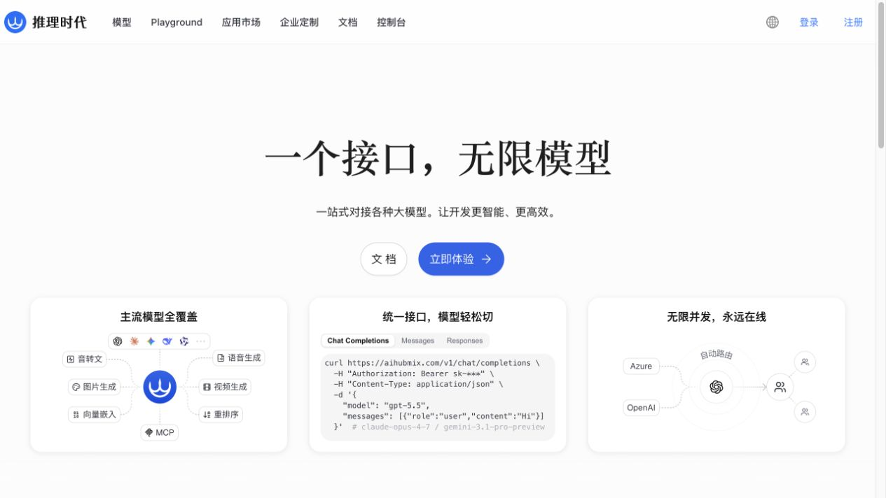
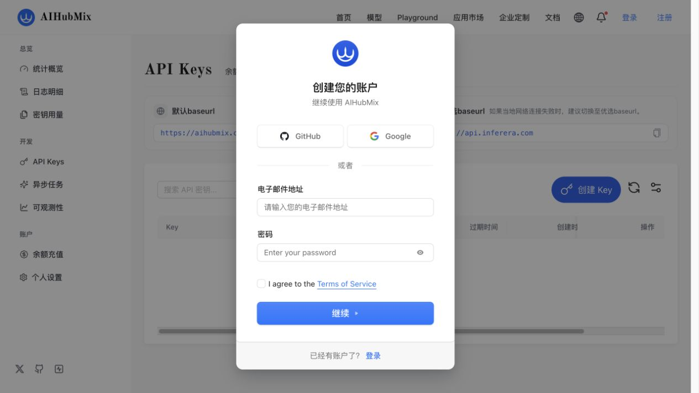
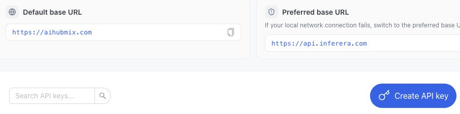
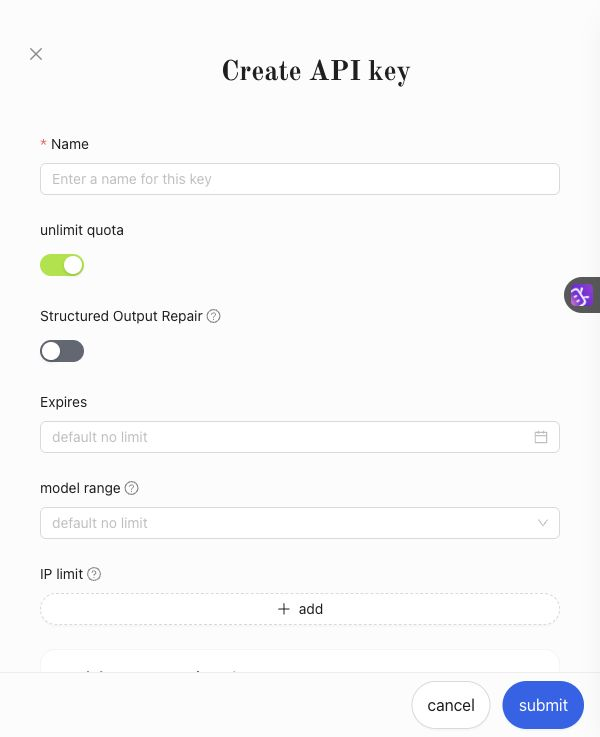
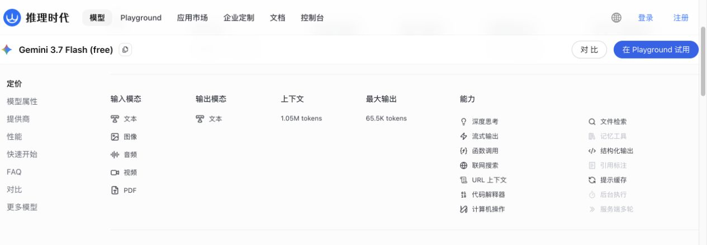

# 申请 AIHubMix API Key，并用免费 Gemini 3.7 Flash 识图

[English](aihubmix-gemini-vision.md) | **中文**

这篇教程完成三件事：

1. 注册 AIHubMix 账号。
2. 创建并安全保存一个 AIHubMix API Key。
3. 在 DSH Vision Toolkit 或普通代码中调用免费的 `gemini-3.7-flash-free` 分析图片。

> 截至 2026-08-20，AIHubMix 模型页把 `gemini-3.7-flash-free` 标为支持图像输入的免费试用模型。免费资源有限，可能返回 `429`，不保证生产环境稳定性；生产用途应切换到正式模型 `gemini-3.7-flash`。模型、价格和可用性可能调整，请以 [AIHubMix 模型页](https://aihubmix.com/model/gemini-3.7-flash-free) 为准。

## 1. 打开申请入口并注册

打开 [Inferera 国内申请入口](https://inferera.com/?aff=5wj6sgx8)，页面会跳转到 AIHubMix；点击右上角 **注册**，也可以点击页面中的 **立即体验**。

这个入口带有本项目的推荐参数；如果不想使用推荐链接，也可以直接访问 [Inferera](https://inferera.com/)。

<p align="center">
  
</p>

注册页支持 GitHub、Google 或邮箱。使用邮箱时，填写邮箱和密码、同意服务条款，然后按页面提示完成验证。

<p align="center">
  
</p>

## 2. 创建 API Key

登录后进入控制台左侧的 **开发 → API Keys**，或直接打开 [AIHubMix API Keys](https://console.aihubmix.com/token)。页面会同时显示两个接口地址：

- 默认地址：`https://aihubmix.com`
- 优选地址：`https://api.inferera.com`

本教程在 Vision Toolkit 中使用优选地址 `https://api.inferera.com/v1`。如果该地址在你的网络中不可用，可以改用 `https://aihubmix.com/v1`。

<p align="center">
  
</p>

点击 **创建 Key**（英文界面显示 **Create API key**），然后：

1. 在 **名称** 中填写容易辨认的名称，例如 `dsh-vision-toolkit`。
2. 首次试用建议关闭无限额度，并设置小额上限、过期时间、模型范围或 IP 限制，避免以后误用付费模型时产生无上限费用。
3. 点击 **提交** 创建密钥。
4. 立即复制完整的 `sk-...` 密钥，并保存到密码管理器或 DSH Credential 中。

<p align="center">
  
</p>

不要把完整 API Key 放进 README、聊天记录、截图、Git 提交、浏览器前端代码或公开日志。密钥泄露后应立即删除旧 Key 并重新创建。

### 在终端中设置密钥

macOS / Linux：

```sh
export AIHUBMIX_API_KEY="sk_your_key_here"
```

Windows PowerShell（只对当前窗口生效）：

```powershell
$env:AIHUBMIX_API_KEY = "sk_your_key_here"
```

确认变量已经存在，但不要打印完整密钥：

```sh
test -n "$AIHUBMIX_API_KEY" && echo "AIHUBMIX_API_KEY is set"
```

## 3. 选择免费的视觉模型

本教程使用准确模型 ID：

```text
gemini-3.7-flash-free
```

模型页将它标为免费，并列出文本、图像、音频、视频和 PDF 输入能力。Vision Toolkit 使用其中的图像输入和文本输出。

<p align="center">
  
</p>

免费版本只适合试用，资源紧张时可能返回 `429 Too Many Requests`。需要稳定调用时，把模型改为 `gemini-3.7-flash`，并确认账户余额足够。模型页列出的联网搜索、缓存等可选能力可能单独计费；Vision Toolkit 的普通图片分析不会主动启用这些能力。

## 4. 在 DSH Vision Toolkit 中使用

1. 打开 DSH Web 的 **设置 → 视觉工具**。
2. 在“在线视觉服务”中填写：

| 字段 | 值 |
|---|---|
| API 协议 | `OpenAI Chat Completions` |
| API 地址 | `https://api.inferera.com/v1` |
| 模型名称 | `gemini-3.7-flash-free` |
| API 密钥 | 粘贴刚创建的 `sk-...` 密钥 |

3. 展开 **高级设置**，把 **凭据名称** 改为 `AIHUBMIX_API_KEY`，避免继续使用内置免费服务的凭据名称。
4. 点击 **保存设置**。密钥会写入 DSH Credentials，页面以后不会回显完整内容。
5. 点击 **测试视觉模型**。这个测试会发送插件自带的诊断图片，验证真实多模态请求；只测试 `/models` 的 **测试 API 连接** 不能代替它。
6. 测试成功后，在会话中粘贴图片并直接提问，例如：

```text
请先逐字抄出截图中的报错，再判断最可能的原因和修复步骤。
```

也可以在 Profile patch 中保存相同配置。密钥值仍应由 DSH Credential 或环境变量提供，不要写入 YAML：

```yaml
- id: vision-toolkit
  config:
    provider:
      protocol: openai
      baseUrl: https://api.inferera.com/v1
      model: gemini-3.7-flash-free
      credential: AIHUBMIX_API_KEY
```

## 5. 用 cURL 直接识别网络图片

下面的请求使用 AIHubMix 的 OpenAI Chat Completions 兼容接口。把示例图片 URL 换成你自己的公开 HTTPS 图片地址：

```sh
curl https://api.inferera.com/v1/chat/completions \
  -H "Authorization: Bearer $AIHUBMIX_API_KEY" \
  -H "Content-Type: application/json" \
  -d '{
    "model": "gemini-3.7-flash-free",
    "messages": [{
      "role": "user",
      "content": [
        {"type": "text", "text": "请描述图片中的主要内容，并逐字抄出可见文字。"},
        {"type": "image_url", "image_url": {
          "url": "https://upload.wikimedia.org/wikipedia/commons/f/f2/LPU-v1-die.jpg"
        }}
      ]
    }],
    "temperature": 0.2,
    "max_tokens": 1024
  }'
```

成功后，模型回答位于 `choices[0].message.content`。

## 6. 用 Python 识别本地图片

下面的例子读取本地图片并转换成 Base64 Data URL。使用 `uv` 临时安装 OpenAI SDK，不修改系统 Python：

```python
# recognize.py
import base64
import mimetypes
import os
from pathlib import Path

from openai import OpenAI

image_path = Path("screenshot.png")
mime_type = mimetypes.guess_type(image_path.name)[0] or "image/png"
image_base64 = base64.b64encode(image_path.read_bytes()).decode("ascii")
data_url = f"data:{mime_type};base64,{image_base64}"

client = OpenAI(
    api_key=os.environ["AIHUBMIX_API_KEY"],
    base_url="https://api.inferera.com/v1",
)
response = client.chat.completions.create(
    model="gemini-3.7-flash-free",
    messages=[{
        "role": "user",
        "content": [
            {"type": "text", "text": "先做 OCR，再指出截图里最重要的异常。"},
            {"type": "image_url", "image_url": {"url": data_url}},
        ],
    }],
    temperature=0.2,
    max_tokens=1024,
)

print(response.choices[0].message.content)
```

运行：

```sh
uv run --with openai python recognize.py
```

## 7. 常见问题

### `401` 或 `Unauthorized`

- 确认粘贴的是完整的 `sk-...` 密钥，而不是 Key 名称或被遮盖后的片段。
- 环境变量中不要包含多余空格、换行或 `AIHUBMIX_API_KEY=` 前缀。
- 如果密钥曾经公开，删除旧 Key 并重新创建。

### `402`、余额不足或模型不可用

- 免费试用模型应使用完整 ID `gemini-3.7-flash-free`。
- 如果改用 `gemini-3.7-flash` 或其他付费模型，请在控制台的 **余额充值** 中补充余额。
- 模型可用性会变化，请以 AIHubMix 当前模型页和控制台为准。

### `404` 或 `model not found`

- 模型名必须准确写成 `gemini-3.7-flash-free`。
- 不要把显示名称 `Gemini 3.7 Flash (free)` 当作 API 模型 ID。

### `429 Too Many Requests`

- 免费模型资源有限，等待后重试，或降低并发和调用频率。
- 需要稳定生产调用时切换到 `gemini-3.7-flash`。

### 连接超时或无法访问

- 先使用本教程推荐的 `https://api.inferera.com/v1`。
- 如果该地址不可用，改为 `https://aihubmix.com/v1` 后重新执行 **测试视觉模型**。

## 官方资料

- [Inferera 国内申请入口](https://inferera.com/?aff=5wj6sgx8)
- [AIHubMix API Keys](https://console.aihubmix.com/token)
- [AIHubMix 中文文档](https://docs.aihubmix.com/cn)
- [Gemini 3.7 Flash (free) 模型页](https://aihubmix.com/model/gemini-3.7-flash-free)
